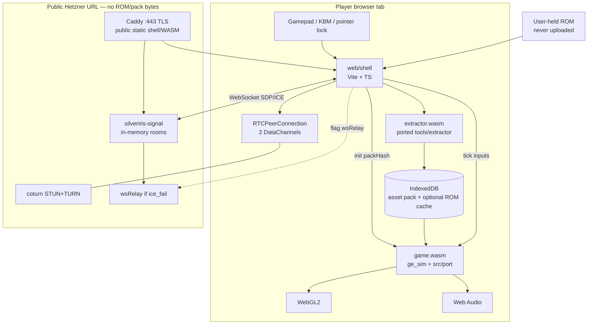
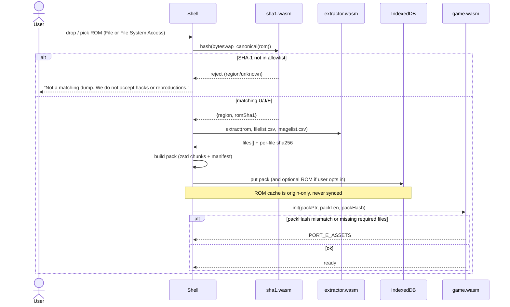
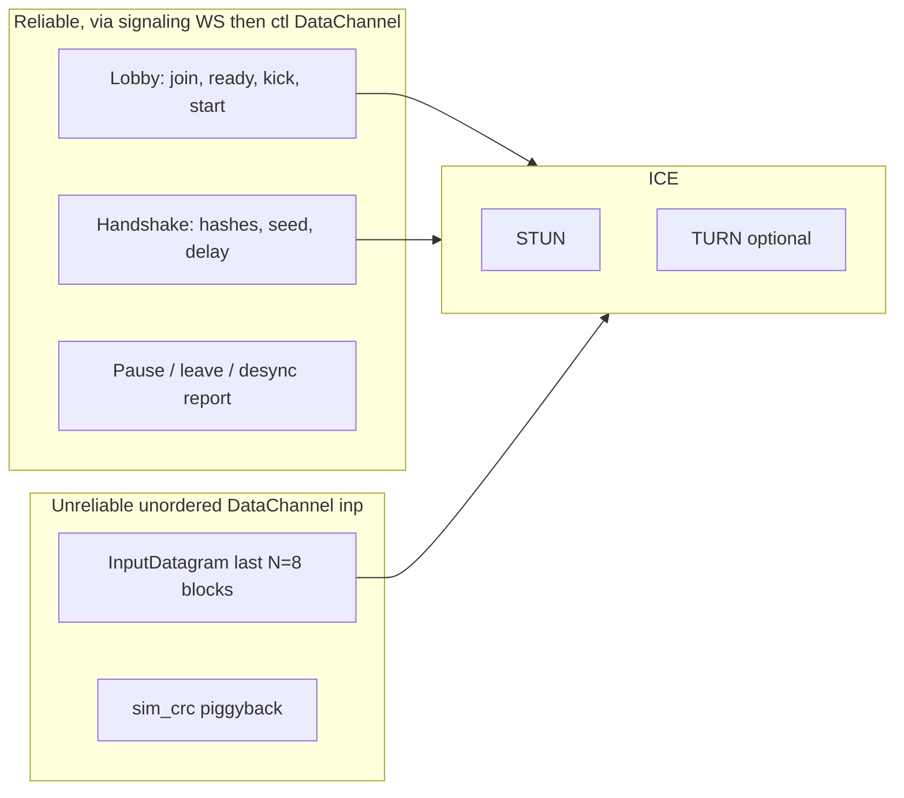
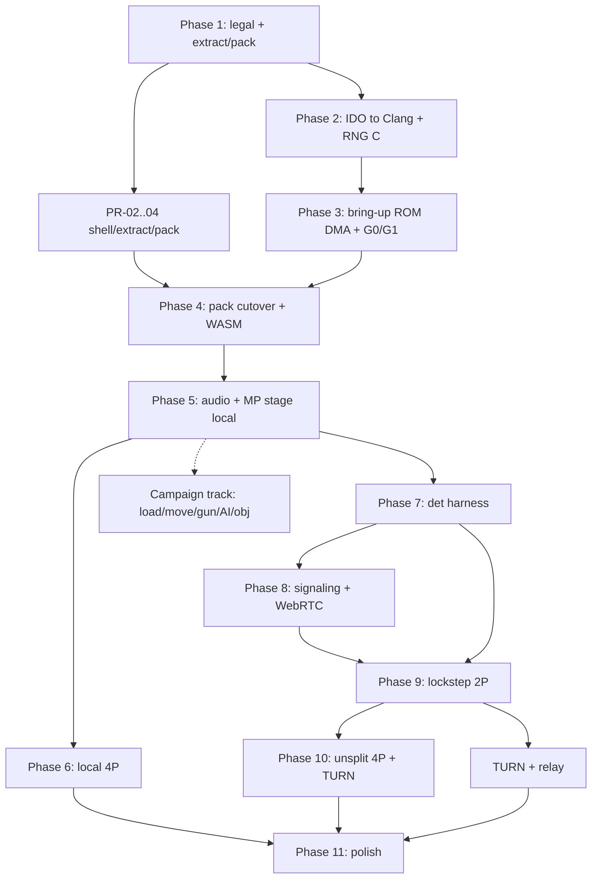

# SilverIris: Browser-native GoldenEye 007 port (ROM-gated, WebRTC lockstep)

| Field | Value |
|---|---|
| **Document title** | SilverIris — browser GoldenEye 007 with Internet + LAN multiplayer |
| **Project name** | **SilverIris**. Do **not** ship under "GoldenEye", "007", "Bond", or Nintendo/Rare/Danjaq marks. *Etymology only:* the internal nickname FOURTRI referred to Rare's custom `4Tri` RSP microcode; it is not a product or package name. |
| **Author** | TBD |
| **Date** | 2026-08-19 |
| **Status** | Draft (rev 6 — public URL, local input, TURN spend deferred) |
| **Audience** | Senior engineers implementing from an empty tree |
| **Subject game** | GoldenEye 007 (N64, 1997) — referred to here as **GE** |
| **Source of truth** | [n64decomp/007](https://github.com/n64decomp/007) (mirror of [gitlab.com/kholdfuzion/goldeneye_src](https://gitlab.com/kholdfuzion/goldeneye_src)), 100% matching as of ~2026-08-17 |

---

## Overview

GoldenEye 007's matching C decompilation reached 100% on ~2026-08-17 (KholdFuzion et al., ~5–9 years depending on how you count the earliest RE). The decomp builds three retail dumps and **does not ship assets** — `./scripts/extract_baserom.u.sh` requires a user-supplied `baserom.u.z64`. That legal pattern is the one we preserve.

This document is the implementation plan for **SilverIris**: a **greenfield** browser-native port of GE. Anyone who opens the public HTTPS URL can load the shell, supply a legally obtained **NTSC-U** ROM in the tab, extract assets **client-side** into a content-addressed pack stored in IndexedDB (`silveriris`), and play (solo, or create/join a room by code). There is **no original netcode**. Hardware GE is local split-screen only. The matching engine is a **VI-driven variable-dt loop** (`GAME_TICKRATE 60`, `speedgraphframes` → `g_ClockTimer`) that *typically* presents near 20 FPS NTSC because a frame of work costs ~3 VI periods — **not** because the sim is a 20 Hz lock. Online/LAN is new functionality: a **new** deterministic lockstep contract that pins `speedgraphframes = 3` and runs that pass at 20 Hz wall, transported on **WebRTC DataChannels**.

The Hetzner box serves **engine, port layer, extractor, and shell only** (plus signaling and coturn) on a **public URL with no access secret**. ROM bytes never leave the origin. Extracted assets never go to our servers. Unknown dumps are rejected, not "best-effort" decoded. Hosting `game.wasm` on a public URL **is** distributing a compiled derivative of Nintendo / Rare / Danjaq / MGM code; ROM-gating is a community convention, not a clearance. First-screen copy is the ROM gate: you must supply a legally obtained NTSC-U dump; we do not provide one; this is not an official product. No store-page-style trailer.

**Recommended approach:** port the decomp C to a new platform layer (`src/port`), bring it up native (desktop, **developer/CI only**) first, then compile the same C with Emscripten. Do not emulate the N64. Do not statically recompile the MIPS binary. Do not rewrite the shooter as a dedicated-server game.

**v1 exit:** **netplay-first**. ROM gate + Facility/Complex 2P lockstep + local split-screen on the **public** URL. Campaign (Dam Agent) is a parallel track (PR-11f / P9), not a gate. Calendar: **6–18 months, two or more engineers**. PR-01 is unblocked (All Rights Reserved + NOTICE). Native public downloads are out of v1.

---

## Background & Motivation

### Current state of the decomp

Canonical tree ([docs/StructureGuide.md](https://github.com/n64decomp/007/blob/master/docs/StructureGuide.md)):

```
goldeneye_src
├── assets/          # extracted, not shipped: font, images, music,
│                    # obseg/{bg,brief,chr,gun,prop,setup,stan,text}, ramrom
├── include/
├── rsp/             # Custom GBI microcode (C0 and 4Tri) — NOT stock Fast3D
│   └── graphics/gmain.s
├── src/
│   ├── game/        # GE-specific, N64 VA 0x7f000000
│   ├── inflate/     # statically linked initial decompression
│   ├── libultra/    # stock libultra
│   └── libultrare/  # Rare-modified libultra (note: directory is libultrare)
├── tools/
│   └── extractor/   # C extractor: ROM + CSV → files (puff / 1172 inflate)
├── imagelist.u.csv      # ROM image offsets/sizes (repo *root*, not scripts/)
└── scripts/
    ├── extract_baserom.u.sh
    ├── extract_diff.j.sh / extract_diff.e.sh
    ├── extract_asp_gsp_rsp.sh
    ├── filelist.{u,j,e}.csv
    └── make/sync_imagelist_with_def.py
```

Matching ROMs the decomp builds (documented). **v1 product `game.wasm` accepts only NTSC-U.** JP/EU hashes are for a follow-on PR (old PR-24), not v1 verify or lobby:

| Region | Filename | SHA-1 | v1 product |
|---|---|---|---|
| NTSC-U | `ge007.u.z64` | `abe01e4aeb033b6c0836819f549c791b26cfde83` | **accepted** |
| NTSC-J | `ge007.j.z64` | `2a5dade32f7fad6c73c659d2026994632c1b3174` | reject (follow-on) |
| PAL-E  | `ge007.e.z64` | `167c3c433dec1f1eb921736f7d53fac8cb45ee31` | reject (follow-on) |

The extractor (`tools/extractor/main.c`) reads a CSV of `offset,size,name,compressed,extract`. Compressed blobs are Rare "1172" streams: a **2-byte header** (`GE_1172_HEADER_LENGTH`) then raw deflate, inflated with `puff.c`. Minimum accepted ROM size is 12 MB. US extract is mandatory; JP/EU are US + `filediff.{j,e}.csv` overlays.

Images are a **second, mandatory pass**: `scripts/make/sync_imagelist_with_def.py` writes `build/u/imagelist.csv` from repo-root `imagelist.u.csv` (offsets/sizes) + `assets/images.def` (names), then the extractor runs again. `scripts/extract_asp_gsp_rsp.sh` is a third pass for ASP/GSP/RSP blobs. v1 **HLE omits raw ucode** from the runtime pack (G1 software path does not execute microcode). The extract script still runs so a developer pack can include ucode for experiments; `game.wasm` must not require those blobs.

The matching build uses IRIX IDO 5.3 (recompiled or qemu-irix). **We will not run IDO in the browser.** The shipped WASM is a **port**, compiled with Clang/Emscripten, not a matching rebuild of `ge007.u.z64`.

### Why a port, and why now

- The C is matching. A port can compile a **curated list** of `src/*.c` + `src/game/*.c` (not `src/game` alone) with Clang once a platform layer replaces libultra OS, VI/AI/SI/PI, and the RSP/RDP.
- Hardware multiplayer is **one shared sim, four local `OSContPad`s, split-screen**. Remote play is a transport + camera problem if the sim can be made deterministic — not a gameplay rewrite.
- Browser is the distribution the product request requires: no native install for players.
- The decomp already has the hooks lockstep wants:
  - `joySetPlaybackFunc` / `joySetRecordFunc` in `src/joy.h` (used by `src/ramrom.c` demos). **`bossMainloop` consumes pads via `joyConsumeSamplesWrapper()`**, not `joyPoll()` — playback must fill the sample ring that wrapper reads.
  - `randomSetSeed` / `randomGetNext` / `g_randomSeed` in `src/random.h` **and** `chrObjRandomSetSeed` / `chrObjRandomGetNext` / `g_chrObjRandomSeed` in `src/game/chrObjRandom.h` (a second, identical LCG).
  - `waitForNextFrame` + `updateFrameCounters` in `src/game/frametiming.c`, and `g_ClockTimer = speedgraphframes` in `src/game/lv.c`.

### Pain points a naive approach would hit

- Rare's RSP microcode (`rsp/graphics/gmain.s`, C0 and 4Tri) is **not** libultra Fast3D. Harbour Masters-style HLE that assumes standard GBI will be wrong. Segment tables, T&L, and 0x7f000000 pointers are the actual job.
- Hardware *presents* near 20 FPS NTSC, but the engine is **not** a 20 Hz lock. `GAME_TICKRATE` is 60. `waitForNextFrame` gates on ~16.55 ms NTSC units (`/ 775875`) with `frameDelay` usually 1. `speedgraphframes` is the variable dt (`deltaFrames`) written by `updateFrameCounters`. If `port_sim_tick` runs one `lv` pass per 50 ms with `speedgraphframes == 1`, the game runs at ~1/3 speed. If `speedgraphframes` stays coupled to `osGetCount()`, lockstep desyncs.
- `struct player` in `src/game/bondview.h` is ~0x2A80 bytes (~10.8 KiB) with viewports (`viewx/viewy/viewleft/viewtop`, `c_screenwidth`, `c_perspaspect`, `viewports[2]`). Split-screen is a first-class data model, not a compositor hack.
- PAL (`VERSION_EU` / `BUGFIX_R1`) uses different types for several HUD timers (`f32` vs `s32` `damageshowtime`) and a 5/6 frame-time scale. Mixed-region sessions **will desync**. They must be refused at handshake.
- There is no existing application code in `/home/grok/GoldenEye`. This is a new repository that **consumes** the decomp as a dependency, it does not become a fork of the matching-build tree.

---

## Goals & Non-Goals

### Goals (v1)

**Default v1 (netplay-first, 1–2 engineers):** items 1–3, 5–9 on an MP stage. Campaign (item 4) is in-tree and staffed if a second engineer exists; it does **not** gate public `netplay`.

1. Run in a current Chromium or Firefox tab. No required native install, no plugin, no ROM download link.
2. Gate all **product** gameplay on a user-supplied matching **NTSC-U** ROM (SHA-1 `abe01e4aeb033b6c0836819f549c791b26cfde83`). Byte-swap-tolerant verify (`z64` / `n64` / `v64`). Native bring-up may DMA a local ROM (K18); release binaries may not. JP/EU dumps are rejected in v1.
3. Extract assets in WASM in the tab. Persist a content-addressed **asset pack** in IndexedDB. Never upload ROM or pack bytes.
4. *(Parallel track, not a v1 gate.)* Playable **solo campaign** (NTSC-U, Dam Agent) once the MP stage path is green.
5. **Internet and LAN multiplayer**, cap 4 players, same netcode, different ICE profile. Public-URL ship bar is **2P lockstep** (join by room code). 4P + coturn TURN is hardening. No v1 public server browser of all in-progress matches.
6. Remote clients render **full-frame Hor+ widescreen** for the local player. The sim still ticks all four `struct player`s. `currentPlayerSetScreenSize` takes **`f32, f32`** (implicit convert from canvas pixels is fine).
7. Deterministic lockstep under the **pinned-`speedgraphframes` contract** (§3.1.1) with a CI harness that replays input tapes on native + WASM and compares per-tick checksums.
8. Preserve original control styles 1.1–2.4 (`CONTROLLER_CONFIG_HONEY` … `GOODHEAD` in `src/bondconstants.h`) **and** add a remappable mouse-look / dual-stick preset as `CONTROLLER_CONFIG_MODERN = 9` (**after** `CINEMA` 0–8; never insert before `CINEMA` or save/watch indices break).
9. Local saves / pak only (IndexedDB). No accounts.

### Non-goals (v1)

- Distributing a playable game without a user ROM.
- Helping anyone obtain a ROM.
- Matching IDO rebuild in the browser.
- Dedicated-server / client-prediction shooter rewrite.
- Mid-game join, spectators, >4 players, ranked, accounts.
- 60 Hz **lockstep** (A8). Presentation interpolates; each lockstep tick is one `speedgraphframes=3` game pass at 20 Hz wall. A 60 Hz-input / present-every-tick mode is a later protocol version.
- User texture packs, gyro, rewind, savestates-as-a-feature, live C mods.
- Running a long-term software RDP as the presentation path.
- Shipping under official trademarks.
- mDNS / UDP broadcast "classic LAN" from a browser tab.
- Public native `.exe` / `.app` download.
- A public **server browser** of all in-progress matches (v1 is room-code join only).
- A store-page-style trailer that looks like a free commercial GoldenEye download.

### Later (explicitly out of v1, designed not to block)

- GGPO-style rollback (requires the determinism harness).
- 60 Hz sim option.
- WebGPU backend.
- Optional accounts, more than 4 players.
- User-provided hi-res textures (still client-side, never hosted).

---

## Key Decisions

| # | Decision | Rationale |
|---|---|---|
| K1 | **Native-first hybrid port**, then Emscripten. Same curated decomp objects (`src/*.c` + `src/game/*.c` + C replacements for needed `.s`) + `src/port`. | Every successful N64 decomp port (sm64-port, SoH, 2s2h) brought up libultra replacement on desktop, where RenderDoc, ASan, and a debugger work. Browser-first would hide determinism and RSP bugs behind WASM. `src/game` alone is not the sim (`boss.c`, `joy.c`, `audi.c`, `lv.c`, `random.s`, libultra…). |
| K2 | **Do not emulate. Do not recomp.** | Emulator netplay is delay-locked to input on a single VI and cannot un-split views or interpolate presentation cleanly. N64Recomp / XBLA recomp is obsolete now that matching C exists. |
| K3 | **Do not rewrite as a dedicated-server FPS.** | That abandons the decomp sim (AI lists, stan collision, gun feel). |
| K4 | **v1 netcode = delay-based lockstep** of the **pinned-`speedgraphframes` pass** at 20 Hz wall. Host is a peer, not an authority sim. | This 20 Hz is a **new port contract** (K15), not “the original tick.” 2–3 lockstep ticks = 100–150 ms. Internet vs LAN is an ICE profile, not two netcodes. Rollback is v2. 60 Hz lockstep is A8 (rejected for v1). |
| K5 | **Install `joySetPlaybackFunc` so `joyConsumeSamplesWrapper()` sees committed `InputBlock`s.** Zero `OSContPad.errno` on both sides. | `bossMainloop` consumes pads via `joyConsumeSamplesWrapper()`, not `joyPoll()`. Wiring playback only into `joyPoll` means lockstep never reaches `lvlViewMoveTick`. `PortPad` is 4 bytes; `errno` must be 0 or stick reads fault. |
| K6 | **Reject unknown ROMs.** v1 product allowlist = NTSC-U SHA-1 `abe01e4aeb033b6c0836819f549c791b26cfde83` after canonicalising byte order. JP/EU hashes are documented, not accepted. | Mixed-region sessions desync (PAL types, 5/6 timing). One region is the v1 QA surface. |
| K7 | **GBI translator owns RSP T&L and the 16-entry segment table.** G1 software path for first picture; G2 emits already-transformed tris to WebGL2. | Rare C0/4Tri is not Fast3D. DLs use segmented addresses. “Tris with matrices” is not an implementation. See §3.6.1. |
| K8 | **Do not drive `speedgraphframes` from `osGetCount`.** `waitForNextFrame` is a no-op. Presentation interpolates to display refresh. | Hardware ~20 FPS is a *consequence* of work taking ~3 VIs, not a lock. Coupling dt to wall-clock desyncs lockstep; `speedgraphframes=1` at 20 Hz runs the game at 1/3 speed. |
| K9 | **Un-split remote views** by writing `struct player` viewport fields (`currentPlayerSetScreenSize(f32,f32)` / `currentPlayerSetPerspective`). | Each remote client sets player *i* to full canvas Hor+. Local couch split-screen stays original. |
| K10 | **Single public Hetzner box:** Caddy (TLS + static shell/`game.wasm`, **no access secret**) + `silveriris-signal` (in-memory rooms) + **coturn** (STUN+TURN). No Cloudflare. ICE policy default `all` (host + srflx + relay). No game-state relay except optional `wsRelay` on `ice_fail && inProgress`. | Public URL, anyone can play. TURN is required capability for random NATs, not a billing workstream. Prefer direct/LAN when ICE can. |
| K11 | **Product `init` loads only a `.c0pack`.** Missing or hash-mismatched pack → refuse. | Mirrors SoH `.o2r`. Lobby compares `packHash`. Bring-up ROM DMA is a separate, flagged exception (K18). |
| K12 | **Vendor decomp as a git submodule** pinned to the 100%-matching commit. Compile the curated list in §1.1. Do not merge IDO / qemu-irix. Pin bumps are a dedicated PR (re-extract, RNG vectors, one tape). | Implicit-int, union punning, and matching-only UB will not “just compile.” Courtesy credit is not a license grant. |
| K13 | **Single-thread the sim.** Audio on a callback. Collapse `src/thread_config.h` threads. Omit the TLB thread. Keep decomp post-load pointer fixup (`file.c`, `bg.c`, `stan.c`, …); only the byte source changes. | Threads are a desync source. 0x7f000000 is a relocation problem, not something to emulate. Do not invent an extractor `.reloc` sidecar. |
| K14 | **No accounts, ephemeral nicknames, 25-bit room codes.** **No instance-wide access secret.** Public-URL abuse controls: IP rate-limit room create/join, unused-room expiry, ephemeral room-scoped TURN creds (no open TURN), `wsRelay` only `inProgress && ice_fail`. Do not log nicks next to IPs. | Anyone can open the URL; signaling/TURN/wsRelay must not become a free internet relay. |
| K15 | **Pin `PORT_SPEEDGRAPHFRAMES = 3` on every `port_sim_tick`.** Call `updateFrameCounters(3)` and let existing `#ifdef`s in `frametiming.c` / `lv.c` write dt. Do **not** write `g_ClockTimer`, `g_GlobalTimerDelta`, or `jpD_800484D0` by hand. Do **not** multiply `jpD_800484D0` by 1.2 — they are independent. Mixed region remains illegal. | Makes 20 Hz wall × 3 game-units = 60 `GAME_TICKRATE` units/s. See §3.1.1. `updateFrameCounters` writes `speedgraphframes` only; `g_ClockTimer` is `lv.c`. |
| K16 | **Bit-exact C of both `random.s` and `chrObjRandom.s`**, golden vectors, handshake seeds both streams, override `randomSetSeed(osGetCount())` on stage load. `SimChecksum` is CRC32C — **never** `fileGenerateCRC`. | Two identical MIPS LCGs; `fileGenerateCRC` folds bytes through `randomGetNextFrom` and would mutate a stream. |
| K17 | **G2 T&L is in the translator.** Segment resolve at interpret time. Pack payloads stay big-endian N64 bytes; 0x0Nxxxxxx stays segmented; 0x7f* call-throughs become a symbol table. | Without this, PR-07 cannot become G2 and Hor+ has nothing correct to draw. |
| K18 | **Bring-up native may `#ifdef PORT_BRINGUP_ROM_DMA` fopen a local `.z64`.** Product `silveriris` / `game.wasm` are compiled **without** that flag and must not `fopen` a ROM. Native binaries are **developer/CI only** — no public download. | Title-boot G0/G1 needs DMA before the pack reader exists. The exception is deleted from release WASM in the pack-cutover PR. |
| K19 | **Watch / `mpmenuon` / pause-arm travel as networked pad.** No separate “local-only watch.” | Original split-screen already shows one player in the watch. A global pause is `ctl` `VOTE_PAUSE` (not v1). |
| K20 | **Hashed MatchConfig** is the packed 160-byte struct in §5.7. Stick styles 1.1–2.4, mouse-look / `CONTROLLER_CONFIG_MODERN`, sensitivity, and keybinds are **local** — not in the hash. Widescreen and volume stay local. | Each player picks mouse vs pad locally in v1. A hashed mouse rule may be a follow-on; it is not v1. |
| K21 | **`inp` datagrams carry the last `N=8` `InputBlock`s.** Stall overlay at 350 ms; drop at 10 s. Optional `ctl` NACK. | Unreliable+unordered with no redundancy stalls a 20 Hz game on any Wi-Fi hop. |
| K22 | **Netplay-first v1 on a public HTTPS URL.** `netplay` may default on after 2P Facility lockstep + green harness. Campaign is not a gate. `LICENSE` is All Rights Reserved for original SilverIris code; decomp C stays unlicensed-to-us. P8 is **public 2P** on that URL, not a CDN launch and not a password gate. | A public play URL + honest ROM gate is the product. Hosting `game.wasm` publicly is still derivative distribution, not a clearance. |

---

## Proposed Design

### 1. Repository layout (greenfield)

`/home/grok/GoldenEye` is empty. The repo we create:

```
silveriris/
├── README.md                    # no ROM links; "you must dump your own cart"
├── LICENSE                      # All Rights Reserved — original SilverIris code only
├── CODE_OF_CONDUCT.md
├── NOTICE                       # decomp C unlicensed-to-us; four-party rights; pin + credits
├── cmake/sources.cmake          # curated object list (§1.1)
├── .gitmodules                  # third_party/goldeneye_src @ 100% commit
├── .github/workflows/
│   ├── no-assets.yml            # fail CI if ROM/asset-sized blobs appear
│   ├── native.yml
│   ├── wasm.yml
│   └── determinism.yml
├── third_party/goldeneye_src/   # submodule: n64decomp/007 @ pinned 100% commit
├── src/
│   ├── port/                    # NEW: libultra replacement + host glue
│   │   ├── os/                  # threads→stubs, mesg queues, timers
│   │   ├── vi/                  # present + vsync
│   │   ├── gfx/                 # GBI → IR → GL
│   │   ├── audio/               # AI/RSP audio → host
│   │   ├── cont/                # joy hooks, Gamepad/KBM mapping
│   │   ├── pak/                 # Controller Pak / EEPROM → host KV
│   │   ├── fs/                  # asset pack reader
│   │   ├── net/                 # lockstep (native + wasm share this)
│   │   └── det/                 # checksum + tape IO
│   ├── glue/                    # EMSCRIPTEN_KEEPALIVE API
│   └── overrides/               # tiny, reviewed patches to decomp C
├── native/                      # SDL2 + OpenGL 3.3 — developer/CI only
│   └── silveriris*.c
├── web/
│   ├── shell/                   # Vite + TypeScript UI
│   └── extractor/               # extractor compiled to WASM + JS wrapper
├── tools/
│   ├── pack/                    # native pack builder (CI + desktop)
│   ├── det/                     # tape replay CLI
│   └── guard/                   # no-ROM / no-asset scanner
├── services/
│   ├── signal/                  # silveriris-signal (Go or Node, in-memory rooms)
│   ├── turn/                    # coturn config
│   └── caddy/                   # Caddyfile (public HTTPS, no basic-auth)
├── testdata/
│   └── tapes/                   # input tapes ONLY (no ROM, no assets)
└── docs/
    └── SilverIris-browser-port-design.md
```

**Decomp consumption rule:** `src/overrides` is the only place we patch decomp C, and every override is a small `#ifdef PORT` or a one-function replacement with a comment citing the original symbol. We compile decomp files by path from the submodule (e.g. `third_party/goldeneye_src/src/game/gun.c`). We do **not** copy the whole tree into `src/game`.

### 1.1 Curated compile list (CMake object library `ge_sim`)

This is the sim. **`src/game` alone is not enough.** `cmake/sources.cmake` is the source of truth; the first IDO→Clang PR fills it. Starting set:

| Unit | Paths | Fate |
|---|---|---|
| Game | `third_party/.../src/game/*.c` | compile; override a handful |
| Root GE | `src/boss.c`, `init.c`, `joy.c`, `vi.c`, `pi.c`, `audi.c`, `snd.c`, `music.c`, `sched.c`, `ramrom.c`, `mema.c`, `memp.c`, `deb.c`, `token.c`, `crash.c`, `fr.c`, `cfb.c`, `sprintf.c`, `str.c`, `speed_graph.c` | compile |
| RNG `.s` | `src/random.s`, `src/game/chrObjRandom.s` | **do not assemble** — replace with bit-exact C (`src/port/rng/random.c`) |
| Other `.s` | `src/boot.s`, `tlb_*.s`, `osMapTLB.s`, `rspboot.s`, `gspboot.s`, `aspboot.s`, `_start.s`, `rom_header.s` | omit or stub; no TLB, no IPL |
| libultra / libultrare | only symbols referenced after the OS shim | replace in `src/port/os` / `gfx` / `audio` / `cont`; do not compile the matching `os*.c` as-is |
| inflate | `src/inflate/*.c`, `tools/extractor/puff.c` | compile (1172) |
| IDO-ism shim | `src/port/compat/ido.h` | implicit-int prototypes, `PR/` includes, `TRUE/FALSE`, `#ifndef __sgi` paths |

**IDO→Clang workstream (before any title-boot PR):** a `ge_sim` target that compiles the list with `-Wall -Werror=implicit-function-declaration -ffp-contract=off` and links a dummy `port_stub` that provides `os*`, `al*`, `vi*`. No window required. This is PR-05a. Implicit int, K&R leftovers, and union punning get shims or tiny overrides here — not during “first picture.”

**CI guard (`tools/guard` + `no-assets.yml`):** fail the build if any file matches:

- extension `.z64 .n64 .v64 .rom`
- path under `assets/` with binary payload
- file size > 256 KiB unless allowlisted (game WASM, shell JS map)
- blob whose SHA-1 is one of the three retail hashes (the two unused-in-v1 hashes still fail CI if a ROM sneaks in)

### 1.2 Decomp submodule pin and credit

- `third_party/goldeneye_src` is a **git submodule** of [n64decomp/007](https://github.com/n64decomp/007) (upstream [gitlab.com/kholdfuzion/goldeneye_src](https://gitlab.com/kholdfuzion/goldeneye_src)), pinned to the **100%-matching commit**. Record that SHA in `.gitmodules` and `NOTICE`.
- Credit **KholdFuzion** and the decomp contributors in `NOTICE` / README as the authors of the matching C. **No claim of affiliation, endorsement, or license grant.** A courtesy ping to the decomp team is encouraged before any public repo; it is not permission.
- **Bump process:** a dedicated PR that (1) updates the pin, (2) re-runs the extractor against a **private** US ROM, (3) re-runs RNG golden vectors, (4) replays at least one private tape native↔wasm. No drive-by pin bumps.
- We do **not** merge matching-build IDO/qemu into SilverIris. We consume C as a library of translation units (`ge_sim`).

### 2. High-level architecture



Nothing on the right-hand side ever receives ROM bytes, extracted assets, or save files that contain level data.

### 3. Platform layer (the actual port)

A matching decomp does not run on a PC or in WASM. We replace libultra / libultrarare the way SoH replaces it with libultraship — but we write our own thinner layer, because GE is not a standard GBI game and we do not need SoH's ImGui/mod host in v1.

#### 3.1 Threading and OS

From `src/thread_config.h`:

| Thread | ID | Pri | Role on N64 | Port fate |
|---|---|---|---|---|
| RMON | 0 | 250 | debug | omit |
| IDLE | 1 | 0 | idle | omit |
| SCHED | 2 | 30 | scheduler (`src/sched.c`) | collapse; `port_sched_submit_gfx/audio` is a function call |
| MAIN | 3 | 10 | game (`src/boss.c`, `src/init.c`) | **the lockstep tick** |
| AUDI | 4 | 20 | audio (`src/audi.c`, `src/snd.c`) | host audio callback; **must not mutate sim state** |
| TLB  | 5 | 40 | TLB (`src/tlb_*.c`) | omit; no virtual map |

Message queues (`OSMesgQueue`) become a small in-process FIFO used only where decomp C still posts/pends. `osGetTime` / `osGetCount` used **inside the sim** must return a tick-derived fake count, never `performance.now()` or `clock_gettime`. Wall-clock is allowed only in the presenter (interpolation) and the net layer (stall timeout).

```c
/* After lockstep tick T has begun (0-based). Use this build's VI unit: */
#if defined(VERSION_EU) || defined(REFRESH_PAL)
#define PORT_CYCLES_PER_VI  931050u   /* waitForNextFrame PAL divisor; OS_CPU_COUNTER/50 */
#else
#define PORT_CYCLES_PER_VI  775875u   /* waitForNextFrame NTSC divisor */
#endif
osGetCount() == T * (uint32_t)PORT_SPEEDGRAPHFRAMES * PORT_CYCLES_PER_VI
```

That value exists so leftover `osGetCount` reads (PAL paths that divide by the PAL VI unit) do not explode. It must **never** feed `updateFrameCounters` or `randomSetSeed`. Unit test (PR-05c, **no `lv.c` yet**): after `updateFrameCounters(3)` and tick `T`, assert `speedgraphframes == 3` and `osGetCount() == T * 3 * PORT_CYCLES_PER_VI` for **this** `#ifdef` build. Do **not** assert `g_ClockTimer` here — that symbol is written in `lv.c` (PR-11a / full `port_sim_tick`).

#### 3.1.1 Tick contract (load-bearing — read before writing `port_sim_tick`)

Hardware GE is **not** a 20 Hz lock. From the matching source:

| Symbol | Where | Hardware meaning |
|---|---|---|
| `GAME_TICKRATE` | `src/bondconstants.h` | **60** |
| `TICKS_PER_SECOND` | same | 60 NTSC / 50 PAL |
| `FRAMES_PER_SECOND` | same | 30 NTSC / 25 PAL |
| `bossMainloop` | `src/boss.c` | VI-driven (`OS_SC_RETRACE_MSG`); runs a game/render pass when `osGetCount() - copy_of_osgetcount_value_1 >= MAIN_LOOP_TICK_INTERVAL` (~half a 60 Hz frame NTSC) **and** `pendingGfx < 2` |
| `waitForNextFrame` | `src/game/frametiming.c` | busy-waits in ~16.55 ms NTSC units (`(+ 387937) / 775875`) or PAL (`(+ 465525) / 931050`); `frameDelay` is usually 1 |
| `updateFrameCounters(deltaFrames)` | same | writes `speedgraphframes = deltaFrames` (and PAL `jpD_800484CC/D0`) |
| `g_ClockTimer` | `src/game/lv.c` | `= speedgraphframes` (0 if paused/locked) |
| `g_GlobalTimerDelta` | `lv.c` | US: `(f32)g_ClockTimer`. EU: `g_JP_GlobalTimerDelta * 1.2f` |

Hardware *typically* presents near 20 FPS because one frame of work costs ~3 VI periods, so `speedgraphframes` lands around 3. That is a **consequence**, not a contract.

**SilverIris port contract (new, hashed into `MatchConfig.protocol = 1`):**

```c
/* src/port/vi/tick_contract.h */
#define PORT_TICK_HZ            20
#define PORT_TICK_MS            50
#define PORT_SPEEDGRAPHFRAMES   3     /* NTSC and PAL */
```

Every `port_sim_tick`:

```c
PortErr port_sim_tick(uint32_t tick) {
    updateFrameCounters(PORT_SPEEDGRAPHFRAMES); /* NOT derived from osGetCount */
    lockstep_install_pads(tick);                /* fills the joy sample ring */
    joyConsumeSamplesWrapper();                 /* what bossMainloop actually calls */
    port_run_game_pass();                       /* one lv/boss body; no VI wait */
    port_crc32c_checksum(tick);
    return PORT_OK;
}

void waitForNextFrame(void) {
    /* no-op. Must not call osGetCount or updateFrameCounters. */
}
```

Derived state after `updateFrameCounters(3)` **plus the existing `lv.c` pass**. These are **independent** `#ifdef`s — two variables, not a chain. Do **not** write either scalar by hand. Do **not** multiply `jpD_800484D0` by 1.2.

| Build | `speedgraphframes` | `g_ClockTimer` | `g_JP_GlobalTimerDelta` (`lv.c`) | `g_GlobalTimerDelta` (`lv.c`) | `jpD_800484CC` | `jpD_800484D0` (`frametiming.c`) |
|---|---|---|---|---|---|---|
| US | 3 | 3 | n/a | `3.0f` (`(f32)g_ClockTimer`) | n/a (no `BUGFIX_R1`) | n/a |
| JP (`BUGFIX_R1`, not PAL refresh) | 3 | 3 | n/a | `3.0f` | `3.0f` | `3.0f` (no `60/50`) |
| EU (`VERSION_EU` / `REFRESH_PAL`) | 3 | 3 | `3.0f` (`(f32)g_ClockTimer`) | **`3.6f`** (`g_JP_GlobalTimerDelta * 1.2f`) | `3.0f` | **`3.6f`** (`deltaFrames * 60/50`) |

An implementer who sets `g_GlobalTimerDelta = jpD_800484D0 * 1.2f` ships PAL **20% fast** (`4.32`) and desyncs every EU tape. `jpD_800484D0` and `g_GlobalTimerDelta` both happen to be `3.6f` at pin-3; they get there by different formulas.

PAL wall-clock lockstep is still 20 Hz so the transport is one protocol. PAL *gameplay* stays PAL because we compile a PAL binary and leave its scale math alone. Mixed-region sessions remain rejected.

Offline `port_pump_offline` uses a 50 ms accumulator and calls the same `port_sim_tick`. Native bring-up may still *present* on vsync; it must not let vsync write `speedgraphframes`.

Changing `PORT_SPEEDGRAPHFRAMES` or `PORT_TICK_HZ` is a new `MatchConfig.protocol`.

#### 3.2 File / PI / asset access

N64 DMA from cartridge (`src/pi.c`, `src/game/file.c`, `src/game/decompress.c`) becomes reads from the asset pack **in product builds**. The pack is memory-mapped (native) or a pointer into a WASM heap view (browser). Rare 1172 inflate stays — we compile `src/inflate` and/or `tools/extractor/puff.c` into the game so runtime decompression of obseg matches.

**Bring-up vs product (K18):**

| Binary | `PORT_BRINGUP_ROM_DMA` | May `fopen` a `.z64`? |
|---|---|---|
| `silveriris` (dev) / `game.wasm` (product) | **undefined** | **No.** `port_init` requires a `.c0pack`. |
| `silveriris_bringup` (developer, ASan) | defined | Yes. `--rom path.z64` DMA via the decomp `filelist` offsets. Used only until pack cutover. |

After the pack-cutover PR, `silveriris_bringup` remains for emergency GBI dumps (CI/dev only, never a public download). A review comment that adds `fopen("*.z64")` under `#ifndef PORT_BRINGUP_ROM_DMA` is a reject.

#### 3.3 Controller / SI

`src/joy.c` already isolates pads:

```c
struct contsample {
    OSContPad pads[MAXCONTROLLERS]; /* 4; each has stick_x, stick_y, button, errno */
};
typedef s32 (*contplaybackfunc)(struct contsample*, s32);
void joySetPlaybackFunc(contplaybackfunc func, s32 controllercount);
void joyConsumeSamplesWrapper(void);   /* what bossMainloop actually calls */
void joyPoll(void);                    /* SI poll — not the lockstep inject point */
s8  joyGetStickX(s8 contpadnum);
u16 joyGetButtons(s8 contpadnum, u16 mask);
```

`OSContPad.errno` is zeroed on every injected sample. A non-zero `errno` makes `joyGetStickX/Buttons` return garbage / “unplugged.” `PortPad` does not network `errno`.

Port plan:

1. Host (native SDL or browser Gamepad/KBM) writes a `port_pad_state[4]`.
2. Offline: copy host pads into the sample ring, then `joyConsumeSamplesWrapper()`.
3. Netplay: `joySetPlaybackFunc(lockstep_playback, nplayers)` where `lockstep_playback` writes the committed `InputBlock` for this tick into `struct contsample` (errno=0). **`port_sim_tick` always ends at `joyConsumeSamplesWrapper()`**, never assumes `joyPoll()` is on the path.
4. Native unit test (`tools/det/test_joy_playback.c`): a known `contsample` (stick 40/−20, `Z_TRIG`, errno 0) installed via `joySetPlaybackFunc` must yield identical `joyGetStickX/Y` and `joyGetButtons` **after** `joyConsumeSamplesWrapper()`. Public CI, no ROM.

Local pads never leak into the sim except via the block.

Rumble (`joyRumblePakStart`) maps to Gamepad haptic / no-op. Controller Pak / EEPROM (`joyGamePakLongRead/Write`, `src/game/file.c` saves) maps to `src/port/pak` → IndexedDB (browser) or a file under the user data dir (native). **Saves never go to the server.** Saves that embed level bytes (if any) stay local; the signaling protocol has no save field.

#### 3.4 Input mapping (shell + port)

Preserve `CONTROLLER_CONFIG` from `src/bondconstants.h`:

| Enum | Watch-menu name |
|---|---|
| `CONTROLLER_CONFIG_HONEY` | 1.1 |
| `CONTROLLER_CONFIG_SOLITARE` | 1.2 |
| `CONTROLLER_CONFIG_KISSY` | 1.3 |
| `CONTROLLER_CONFIG_GOODNIGHT` | 1.4 |
| `CONTROLLER_CONFIG_PLENTY` | 2.1 |
| `CONTROLLER_CONFIG_GALORE` | 2.2 |
| `CONTROLLER_CONFIG_DOMINO` | 2.3 |
| `CONTROLLER_CONFIG_GOODHEAD` | 2.4 |
| `CONTROLLER_CONFIG_CINEMA` | cinema (not a play style) |

Plus `CONTROLLER_CONFIG_MODERN = 9` (port addition, **appended after `CINEMA` (0–8)**; never inserted earlier — watch/save indices are positional). Mouse-look + WASD or left-stick move / right-stick look, pointer lock, remappable in the shell. Modern mapping is applied **before** the `OSContPad` is written, so the sim still sees a stick/buttons sample. That keeps lockstep and ramrom-shaped tapes format-stable. `options.h` is include-guarded `_WATCH_H_`; `cur_player_set_control_type` is the setter.

Mouse-look conversion (shell, not sim):

```
stickX = clamp(mouseDx * sens, -80, 80)   // match N64 OSContPad range
stickY = clamp(-mouseDy * sens, -80, 80)
buttons |= mouseLeft  ? Z_TRIG : 0
buttons |= mouseRight ? R_TRIG : 0        // aim, style-dependent
```

The conversion is deterministic given `(mouseDx, mouseDy)` **quantized to integer counts for that tick**. The tape stores the resulting `OSContPad`, not raw mouse deltas, so two clients with different sensitivities still agree if they are not the same seat. Each seat's mapping is local; only the `OSContPad` is networked.

**Input device is local (K20 / R9).** Each player chooses 1.1–2.4 or `CONTROLLER_CONFIG_MODERN` (mouse-look / dual-stick), plus sensitivity and binds, on their own machine. The shell may pointer-lock whenever the local player wants mouse. There is **no** lobby toggle and **no** “controller-only room” in v1. A follow-on may hash a mouse rule later; it is not in `MatchConfig` now.

#### 3.5 Audio

`src/audi.c`, `src/snd.c`, `src/music.c` + ASP microcode (`src/aspboot.s`). v1 plan:

1. **Bring-up:** stub AI; silence. First picture does not need audio.
2. **Solo playable:** HLE the audio command list Rare already builds (not a full RSP interpreter if we can avoid it). Output 16-bit stereo at 22.05 or 44.1 kHz into:
   - native: SDL audio callback
   - browser: `AudioWorklet` pulling from a ring buffer the WASM fills
3. Audio mixing may use host float; **it must not call `randomGetNext` or write gameplay state**. If the original mixer reads the sim RNG, snapshot the needed values at tick boundary or give audio a separate seeded stream that is not checksummed. Prefer: audio is a pure function of sim-visible events already committed.

Latency target: < 80 ms weapon-to-heard. Not sample-accurate to N64 AI DMA; "accurate enough that music tempo and gun tails are recognizable."

#### 3.6 Graphics — the hard platform piece

Rare custom GBI: `rsp/graphics/gmain.s` (C0, 4Tri). This is **not** Fast3D / F3DEX. A SoH-style Fast3D HLE will mis-parse command words.

**Phased renderer:**

| Phase | What | Exit criterion |
|---|---|---|
| G0 | Dump **segment table + matrices + raw `Gfx[]`** per `osSpTaskLoad` (not just an opcode histogram) | We can replay a title task offline |
| G1 | Interpreter: segments, matrix stack, software T&L, software raster or tiny RDP HLE → RGBA blit | **First picture** (title; MP stage skybox preferred under netplay-first) |
| G2 | Same interpreter emits already-T&L’d `GirCmd`s to GL 3.3 / WebGL2 | 20 Hz present, correct textures, no software RDP on the hot path |
| G3 (post-v1) | Same IR → WebGPU | optional |

#### 3.6.1 GBI contract (segments, T&L, relocation)

N64 Gfx is not host pointers. C0/4Tri DLs are walked with a **16-entry segment table** (`gSPSegment`). Address resolve:

```
phys = segment_base[(addr >> 24) & 0xF] + (addr & 0x00FFFFFF)
```

**Segment table lifetime:** reset to 0 at the start of each graphics task. `gSPSegment` writes `segment_base[seg] = pack_resolve(raw)`. The table is interpreter state, not GL state. G0 dumps all 16 bases as raw `u32` alongside the `Gfx[]`.

**T&L ownership:** the translator **does** RSP T&L. It maintains the modelview/projection stack (`gSPMatrix`, `gSPPopMatrix`), transforms verts to clip space, then emits `GIR_DRAW_TRIS`. The GL backend never sees a `gSPMatrix`. The earlier “already T&L’d *or* with matrices” hedge is resolved: **already T&L’d**. G1 and G2 share this interpreter; only the raster changes.

IR after that decision:

```c
/* src/port/gfx/gbi_ir.h */
typedef enum {
    GIR_SET_VIEWPORT,
    GIR_SET_SCISSOR,
    GIR_SET_COMBINE,
    GIR_SET_OTHERMODE,
    GIR_BIND_TEX,      /* after TLUT + tile decode */
    GIR_SET_FOG,
    GIR_DRAW_TRIS,     /* clip-space, indexed; NO matrices in payload */
    GIR_DRAW_RECT,     /* 1-cycle fill / texrect HUD */
    GIR_SYNC
} GirOp;
```

**Texture / TLUT:** `gDPSetTextureImage` / `gDPLoadTLUT` / `gDPLoadBlock` / `gDPSetTile` load into a software TMEM model (4 KiB + palette slots). Decode CI4/CI8/RGBA16/IA8 as `src/game/image.c` / `image_bank.c` describe, cache RGBA8 by `(image_id, tlut_hash)` in a GL atlas. **Do not** persist decoded textures outside the origin.

**Pointer fixup (no TLB thread, no extractor `.reloc` sidecar):**

v1 does **not** invent a reloc table. The matching loaders already know which words are pointers (`src/game/file.c`, `bg.c`, `stan.c`, and the chr/gun/setup loaders they call). Keep that post-load fixup. Only the **byte source** changes:

| Kind of pointer | Where | Port action |
|---|---|---|
| Segmented `0x0Nxxxxxx` | Gfx DLs, many assets | resolve at interpret time via the segment table. **No rewrite.** |
| Pack file payloads | `.c0pack` blobs | stored **verbatim big-endian N64 bytes**. Manifest integers are little-endian. Feed the same dest buffer the N64 DMA would have filled. |
| Setup / stan / chr / gun / bg pointers | extracted segs | **existing loader fixup after the copy.** If the dest address is not the original N64 load base, add `(host_base - original_load_base)` to words that loader already treats as pointers, per format. Do not scan the file for “anything that looks like a pointer.” |
| 0x7f000000-range | matching-build game `.text` (TLB) | host `.text` in the port. Residual 0x7f* *call-throughs* in data become a **symbol-id → host fn** table as those call sites are hit. We do not emulate TLB. We do not pre-census them in the extractor. |

A generic sidecar would require a pointer census the decomp extractor does not have. PR-11a (Facility stage load) is specified once the existing `file.c` / `bg.c` / `stan.c` path runs against pack bytes (or ROM DMA under K18). If a leftover 0x7f* in a named seg still breaks after that, file a one-off override in `src/overrides` — do not grow a new extract format.

G0 dump record (one file per task, developer-only, never committed if it contains assets; CI stores a hash of the `Gfx` words):

```
u32 magic "G0T1"
u32 n_gfx, n_seg
u32 segment[16]
u32 mtx_modelview[16], mtx_projection[16]   /* bitcast f32; 0 if unknown */
u64 gfx_words[n_gfx]                        /* raw Gfx */
```

Widescreen Hor+: change `c_perspaspect` / `currentPlayerSetPerspective` for the local view. Do not stretch 4:3. Vertical FOV stays native; horizontal expands. Presenter-only; **exclude** view matrices from `SimChecksum`. Collision, aim, and auto-aim stay in the original 4:3 math (v1: FOV is visual-only).

Split-screen local couch play: leave `struct player` viewports as the original 2/3/4-way layouts (`ENVIRONMENTDATA_PLAYERS_2/3/4` in `bondconstants.h`). Remote play: see §5.6.

**Risk (High):** C0/4Tri HLE is the longest pole after determinism. Mitigation: G1 software path unblocks "picture in window" so other work is not gated on a perfect GL mapper.

### 4. ROM ingest, verify, extract, pack

#### 4.1 Sequence



No step in this diagram has a network call.

#### 4.2 Byte-swap canonicalisation

N64 dumps exist as:

- `.z64` big-endian (what the decomp hashes)
- `.n64` byte-swapped 32-bit
- `.v64` byte-swapped 16-bit

```ts
// web/shell/src/rom/byteswap.ts
export type RomEndian = "z64" | "n64" | "v64";

export function detectEndian(u8: Uint8Array): RomEndian {
  // GE US z64 starts 80 37 12 40
  const b0 = u8[0], b1 = u8[1], b2 = u8[2], b3 = u8[3];
  if (b0 === 0x80 && b1 === 0x37) return "z64";
  if (b0 === 0x40 && b1 === 0x12) return "n64";
  if (b0 === 0x37 && b1 === 0x80) return "v64";
  throw new Error("unrecognised N64 header");
}

export function toZ64(u8: Uint8Array): Uint8Array {
  const kind = detectEndian(u8);
  if (kind === "z64") return u8;
  const out = new Uint8Array(u8.byteLength);
  if (kind === "v64") {
    for (let i = 0; i < u8.length; i += 2) {
      out[i] = u8[i + 1]; out[i + 1] = u8[i];
    }
  } else {
    for (let i = 0; i < u8.length; i += 4) {
      out[i] = u8[i + 3]; out[i + 1] = u8[i + 2];
      out[i + 2] = u8[i + 1]; out[i + 3] = u8[i];
    }
  }
  return out;
}
```

SHA-1 is computed on the **z64 canonical** bytes and compared to the three allowlist hashes. Anything else is rejected. We do not try "close" dumps, overdumps, or header-repaired files.

#### 4.3 Extractor WASM

Port `tools/extractor/main.c` + `puff.c` + `fread_csv_line.c`:

- Replace `fopen/fwrite` with an in-memory VFS (write callbacks into a `Map<string, Uint8Array>`).
- Drop pthreads for v1 (GE extract is a few hundred files, 12 MB ROM; single-thread in a Worker is fine — budget **5–20 s** on a laptop, show progress).
- Ship `scripts/filelist.{u,j,e}.csv`, repo-root `imagelist.u.csv`, `assets/images.def`, and `scripts/make/sync_imagelist_with_def.py` **as data files in the extractor package**. These are offset maps / name tables, not assets.
- Extract is **three passes**, matching `extract_baserom.u.sh`: (1) `filelist.*.csv` files, (2) generated `build/u/imagelist.csv` images, (3) `extract_asp_gsp_rsp.sh` equivalent. v1 runtime **HLE omits ucode** — asp/gsp/rsp blobs are optional in the pack (`flags` bit1 = has_ucode) and `game.wasm` must boot without them.
- After US extract, if region is J or E, apply `filediff.{j,e}.csv` exactly as `extract_diff.*.sh` does.
- Paths written into the pack **must match the CSV `name` field byte-for-byte** (decomp relative, e.g. `assets/obseg/bg/...`).

Extractor public API:

```ts
// web/extractor/src/index.ts
export interface ExtractProgress {
  done: number;
  total: number;
  current: string;
}

export interface ExtractedFile {
  path: string;          // e.g. "assets/obseg/bg/bg_dam.seg"
  sha256: string;        // hex
  bytes: Uint8Array;
}

export function extractRom(
  z64: Uint8Array,
  region: "U" | "J" | "E",
  onProgress: (p: ExtractProgress) => void,
): Promise<ExtractedFile[]>;
```

#### 4.4 Asset pack format (`*.c0pack`)

Content-addressed, designed so two extracts of the same ROM produce the same bytes.

```
c0pack v1
---------
# Integers in the header/manifest/trailer are little-endian.
# File *payloads* are verbatim ROM bytes (big-endian N64 data). Do not byteswap insides.

magic:      "C0PK" (4)
version:    u16le = 1
region:     u8  (0=U, 1=J, 2=E)
flags:      u8  (bit0 = zstd chunks; bit1 = pack includes asp/gsp/rsp ucode)
fileCount:  u32le
packHash:   sha256[32]   # hash of (manifest canonical bytes); duplicated in trailer
manifest:   FileEntry[fileCount]
  pathLen   u16le
  path      utf8, POSIX `/`, no leading slash
            alphabet: [A-Za-z0-9_./-] only
            must equal the decomp filelist/imagelist `name` byte-for-byte
            must start with "assets/" or "bin/"
  offset    u64le        # from start of blob section
  size      u32le        # uncompressed
  sha256    [32]
  codec     u8           # 0=store, 1=zstd
blobSection:
  bytes...               # files in manifest order, raw N64 endian
trailer:
  packHash  sha256[32]   # must match header
```

Canonicalisation for `packHash`: SHA-256 of the manifest with paths sorted UTF-8, ignoring `offset` (recomputed), including each file's `sha256`. Two implementations (native `tools/pack` and JS builder) must match; CI builds a pack from a locally provided ROM **on a trusted machine** (not in public CI) and checks the JS builder against it. Public CI only checks the empty-ROM reject path and pack parser fixtures made of **synthetic** files (`testdata/pack/synthetic.c0pack`).

Expected size: extracted GE tree is on the order of the 12 MB ROM plus inflated obseg. Budget **20–60 MB** uncompressed, **12–25 MB** zstd. IndexedDB can hold this. Persist:

| Key | Store | Default |
|---|---|---|
| `pack:<packHash>` | `packs` | yes, after successful extract |
| `rom:<romSha1>` | `roms` | **no** — only if user checks "keep ROM in this browser" |
| `save:<slot>` | `saves` | yes, local only |
| `settings` | `kv` | yes (sensitivity, modern controls, TURN-force) |

`game.wasm` `init()` verifies `packHash` and every file the current stage requests. Any mismatch → hard refuse. There is **no CDN cache of packs**. There is **no** "download a pack a friend extracted."

### 5. Multiplayer

#### 5.1 What the original game actually is

One process, up to 4 `OSContPad`s (`MAXCONTROLLERS`), one sim, split views. Menu state that must agree lives in `src/game/front.h`:

- `selected_num_players`, `player_char[]`, `MP_stage_selected`, `game_length`, `scenario`, `aim_sight_adjustment`
- `player_handicap[]`, `controlstyle_player[]` (per-player control style is visual/input-side; **networked pad is already style-applied**)
- `array_favweapon[4][2]`, unlock flags, `reset_mp_options_for_scenario()`

Scenarios, stage ids, and weapon sets are decomp enums. The lobby serialises this struct, not a parallel "rules" invention.

There is no netcode to "enable."

#### 5.2 Why lockstep, why 20 Hz, why not a dedicated server

| Approach | Verdict |
|---|---|
| Dedicated server + client prediction | Would require rewriting gun, collision, AI. Abandons the decomp. **Reject for v1 and likely forever.** |
| Emulator netplay (input delay on mupen/ares) | Does not use the decomp. Cannot un-split, cannot 60 Hz present, cannot widescreen correctly. **Reject.** |
| Rollback (GGPO) | Right long-term feel on >80 ms paths, but needs confirmed determinism and savestate of `struct player` × N plus chr/prop/explosion pools. **v2.** |
| **Delay lockstep at 20 Hz wall, `speedgraphframes=3`** | **v1 (new contract, K15).** Input block is small. 2 ticks of delay = 100 ms, 3 = 150 ms. This matches how GE *felt* (a ~20 FPS present of a 60-unit/s sim), it is not “the original lock.” |

Internet vs LAN share this netcode. Difference is ICE:

| Profile | ICE | Room | Expected RTT | Default delay |
|---|---|---|---|---|
| LAN | host candidates preferred; STUN optional; TURN off | short code via same signaling, or self-hosted signaling on the LAN | < 5 ms | 1 tick (50 ms) |
| Internet | STUN always; TURN if needed | short code on hosted signaling | 20–80 ms typical, 150+ transcontinental | 2 ticks (100 ms), 3 if measured RTT > 80 ms |

Delay is chosen at handshake from a 500 ms ping-pong on the reliable channel and is **hashed into the session** so everyone uses the same value. It does not change mid-match in v1.

#### 5.3 Session model

- 1–4 peers. v1: **no mid-game join**. Late arrivals get `ROOM_IN_PROGRESS` and may spectate only if we add that later (we will not in v1).
- One peer is **host** for lobby authority only: stage/rules edits, kick, start. Host is **not** sim authority. Every peer runs the same tick.
- If host disconnects in lobby → room closes. If host disconnects in match → match ends (v1; migrating host is a later PR).
- Each peer occupies one seat `0..n-1`. Seat 0 is host.

#### 5.4 Determinism contract

The sim is deterministic if, given `(packHash, region, matchConfigHash, rngSeed, InputBlock[0..t])`, all peers compute the same world at tick `t`.

**Rules we will enforce in `src/port` and overrides:**

1. **Two RNGs, both required.** `src/random.s` (`g_randomSeed`, `randomGetNext`, `randomGetNextFrom`, `randomSetSeed`) **and** `src/game/chrObjRandom.s` (`g_chrObjRandomSeed`, `chrObjRandomGetNext`, `chrObjRandomSetSeed`). They are the **same** MIPS64 LCG (`dsll32`/`xor`, init word `0xAB8D9F77 0x81280783`) on two seeds. `randomSetSeed(x)` / `chrObjRandomSetSeed(x)` store `(u64)x + 1`. Replace both `.s` files with one bit-exact C implementation (`src/port/rng/random.c`) and two instances. Golden vectors in `testdata/rng/`: first 256 `u32` outputs from seeds `0` and `1` for each stream. Public CI. Do not “simplify” the LCG.
2. **Handshake seeds both streams; override boot reseeds.** `bossMainloop` calls `randomSetSeed(osGetCount())` on every stage load — leaving that in place makes every match non-deterministic. Overrides:
   ```c
   /* at match start and on every in-match stage load */
   randomSetSeed(rngSeed ^ (loadOrdinal * 0x9E3779B9u));
   chrObjRandomSetSeed((rngSeed ^ 0x4A1B2C3Du) ^ (loadOrdinal * 0x9E3779B9u));
   ```
   `loadOrdinal` starts at 0 and increments per stage load (deterministic). Ban `rand()`, `random()`, `rdtsc`, `std::random_device`.
3. **Audit call sites** (do this in the RNG PR, not later): every `randomGetNext*`, `chrObjRandom*`, `randomSetSeed`, `fileGenerateCRC`. Known buckets: gameplay, `shuffle_player_ids` (must run *after* the seeded start), save CRC (keep `fileGenerateCRC` for pak files only — it folds bytes through `randomGetNextFrom(&polynormal)` and must not touch `g_randomSeed` during a tick checksum), audio (must not call either stream).
4. No wall-clock in sim. `osGetTime` / `osGetCount` are tick-derived (§3.1). They must not reseed RNG or write `speedgraphframes`.
5. Single-threaded tick. No data races.
6. Compile native and WASM with `-msse2` / equivalent and `-ffp-contract=off`. Keep original `f32` math. **If native vs WASM diverge**, first `PRECISE_F32=1`; then isolate via the tape harness; do not rewrite the engine to fixed-point in v1. Det CI also builds a **linux-i686 / `-m32`** native so pointer width matches wasm32 as closely as we can.
7. Do not let audio, renderer, or HUD layout write sim state. Viewport size is presenter state.
8. PAL vs NTSC is a different binary / `#ifdef VERSION_EU`. A session pins `region` to one of `U|J|E`. Mixed packs are rejected.

**Checksum** (every tick, piggybacked on `inp`, snapshot on `ctl` every 4 ticks):

```c
/* src/port/det/checksum.c — CRC32C (Castagnoli). NEVER fileGenerateCRC. */
typedef struct {
    uint32_t tick;
    uint32_t rng_lo, rng_hi;          /* g_randomSeed */
    uint32_t chr_rng_lo, chr_rng_hi;  /* g_chrObjRandomSeed */
    uint32_t crc_players;             /* pos, vv_theta, vv_verta, health, armour, ammoheldarr, bonddead */
    uint32_t crc_chrs;                /* chr pos, health, action */
    uint32_t crc_props;               /* projectile/explosion/door state */
    uint32_t crc_objectives;          /* MP score / scenario counters */
} SimChecksum;
```

`src/game/crc.c` `fileGenerateCRC` is **not CRC32**. It walks `[addressA, addressB)` folding each byte through `randomGetNextFrom(&polynormal)` into two checksums on `save_data`. Using it for `SimChecksum` would mutate a stream and is the wrong algorithm. Keep it **only** for Controller Pak / EEPROM save headers.

**Exclude** view matrices and purely presentational colour-fade fracs. When in doubt, include — a false desync is better than a silent one.

Mismatch → disconnect all peers with `DESYNC` and offer the ROM-free field report in §Observability. Never attach ROM.

#### 5.5 Input block and lockstep loop

```c
/* src/port/net/input_block.h — also mirrored in TS */
#define PORT_MAX_PLAYERS 4
#define PORT_INPUT_MAGIC 0x49314E42 /* "BIN1" */

typedef struct {
    int8_t  stick_x, stick_y;
    uint16_t buttons;          /* OSContPad.button */
} PortPad;                     /* 4 bytes */

typedef struct {
    uint32_t magic;
    uint32_t tick;
    uint8_t  seat;
    uint8_t  nseats;
    uint8_t  delay;            /* agreed at handshake */
    uint8_t  reserved;
    PortPad  local;            /* this seat's pad for `tick` */
    uint32_t sim_crc;          /* crc32c mix at tick-1, 0 if tick==0 */
} InputBlock;                  /* 20 bytes */

#define PORT_INPUT_REDUNDANCY  8   /* last N ticks per datagram */

typedef struct {
    uint32_t magic;            /* "BINR" */
    uint8_t  seat;
    uint8_t  count;            /* 1..PORT_INPUT_REDUNDANCY */
    uint8_t  reserved[2];
    InputBlock blocks[PORT_INPUT_REDUNDANCY]; /* [0] = newest */
} InputDatagram;               /* sent on "inp" */
```

Unreliable/unordered DataChannel `"inp"` carries `InputDatagram` (the last **N=8** `InputBlock`s this seat produced). A dropped packet is healed by the next one. Reliable ordered DataChannel `"ctl"` carries handshake, pause, checksum snapshots, **NACK** (`{t:"nack", fromTick, toTick}` if a hole survives `N` datagrams), and "I am leaving." Receiver: accept any `blocks[i].tick` we do not yet have; ignore duplicates; never apply a pad for tick `t` until all seats have `t`.

```mermaid
sequenceDiagram
  participant A as Peer A (seat 0)
  participant B as Peer B (seat 1)
  participant SimA as sim A
  participant SimB as sim B

  Note over A,B: delay = 2 ticks, now = t; each send is last N=8 blocks
  A->>B: InputDatagram(seat=0, blocks t+2..t-5)
  B->>A: InputDatagram(seat=1, blocks t+2..t-5)
  A->>A: buffer local pad as InputBlock(t+2)
  B->>B: buffer local pad as InputBlock(t+2)

  Note over SimA,SimB: when InputBlock[t] complete for all seats
  A->>SimA: joy playback pads[t]; port_sim_tick()
  B->>SimB: joy playback pads[t]; port_sim_tick()
  SimA-->>A: checksum(t)
  SimB-->>B: checksum(t)
  A->>B: checksum(t) on inp
  B->>A: checksum(t) on inp
  alt mismatch
    A-->>A: halt DESYNC
    B-->>B: halt DESYNC
  end
```

**Stall policy:** if a peer's block for tick `t` is still missing **350 ms** after we were ready to run `t`, pause the sim (`ctl` `STALL`) and overlay "waiting for P*n*". Send a `ctl` `nack` for the hole. After **10 s** more, disconnect that seat and **end the match** (v1 does not drop to 3 mid-sim). 1.5 s of silent wait is not acceptable on Wi-Fi or cellular; redundancy is what makes 350 ms viable.

**Background tabs:** browsers throttle hidden timers to 1 Hz. Mitigation: `navigator.wakeLock` (screen), play a silent `AudioWorklet` to reduce throttle, and if `document.hidden` during a match, send `STALL` immediately and overlay "tab must stay visible." There is no good fix; document it.

**Local prediction:** none in v1. You see the world at `t` after exchanging inputs for `t`. With delay 2, you press fire and the shot exists 100 ms later for everyone including you.

#### 5.6 Un-split remote camera

On a remote client seated as `i`:

```c
/* after lvl load, before first tick */
for (int p = 0; p < nseats; p++) {
    /* sim still updates all players */
}
/* presenter */
port_set_view_seat(i);
/* currentPlayerSetScreenSize takes f32, f32 — implicit convert from canvas px */
currentPlayerSetScreenSize((f32)canvas_w, (f32)canvas_h);
currentPlayerSetScreenPosition(0.0f, 0.0f);
currentPlayerSetPerspective(near, native_fovy, (f32)canvas_w / (f32)canvas_h);
```

HUD (`maybe_mp_interface`, watch menu) is drawn only for seat `i`. Radar and other players' 3P models stay; they are sim-visible. Local split-screen on one machine does **not** use this path.

Pause / watch menu in netplay (K19): opening the watch (`mpmenuon` on `struct player`) is a **local pad button** and therefore is in the `InputBlock`. All peers will see that player enter the watch animation. That is original behaviour in split-screen (one player can fuss with the watch). We keep it. A "pause the match" is a separate `ctl` `VOTE_PAUSE` if we want it; v1 skips global pause.

#### 5.7 Match config hash

`MatchConfig` is **only** the packed byte layout below. TS and C share one encoder (`encodeMatchConfig` / `src/port/net/match_config.c`) that writes **explicit field offsets** (or `__attribute__((packed))` plus a locked endian helper). Hash = `SHA-256` of those bytes. **The wire uses the same bytes:** signaling `t:"cfg"` carries `cfg` as hex (or unpadded base64) of that buffer, plus `cfgHash` as hex SHA-256. JSON is allowed only for lobby strings (nicks, codes, SDP text). Never JSON-encode `slider007[]` or the rest of the struct — a peer that hashes C bytes and another that re-JSON-encodes floats will disagree.

```c
/* src/port/net/match_config.c — little-endian, packed, explicit offsets */
typedef struct {
    uint16_t protocol;           /* 1 */
    uint8_t  region;             /* 0=U 1=J 2=E */
    uint8_t  nseats;             /* 2..4 */
    uint8_t  delayTicks;         /* 1..3 */
    uint8_t  speedgraphframes;   /* must be PORT_SPEEDGRAPHFRAMES (3) */
    uint8_t  aimSight;           /* aim_sight_adjustment */
    uint8_t  autoAim;            /* cur_player autoaim — HASHED (changes feel) */
    uint8_t  lookAhead;          /* lookahead */
    uint8_t  aimControl;         /* hold vs toggle */
    uint8_t  radar;              /* 1 = radar on; 0 = no-radar (CHEAT_NO_RADAR_MP) */
    uint8_t  pad0;               /* must be 0; reserved — do not reuse for mouse */
    uint32_t rngSeed;
    uint32_t stage;              /* MP_stage_selected / LEVELID */
    uint32_t scenario;           /* MPSCENARIOS */
    uint32_t gameLength;         /* GAMELENGTH */
    uint32_t chars[4];           /* player_char[] */
    uint32_t handicaps[4];
    uint32_t favWeapons[4][2];
    float    slider007[4];       /* reaction, health, accuracy, damage; 0 if not 007 */
    uint8_t  packHash[32];
    uint8_t  buildId[20];        /* git sha raw */
} MatchConfig;                   /* sizeof must match encodeMatchConfig output */
```

Offset table (little-endian; this is the wire spec, not “whatever the ABI pads”):

| Offset | Size | Field |
|---|---|---|
| 0 | 2 | `protocol` |
| 2 | 1 | `region` |
| 3 | 1 | `nseats` |
| 4 | 1 | `delayTicks` |
| 5 | 1 | `speedgraphframes` |
| 6 | 1 | `aimSight` |
| 7 | 1 | `autoAim` |
| 8 | 1 | `lookAhead` |
| 9 | 1 | `aimControl` |
| 10 | 1 | `radar` |
| 11 | 1 | `pad0` (must be 0) |
| 12 | 4 | `rngSeed` |
| 16 | 4 | `stage` |
| 20 | 4 | `scenario` |
| 24 | 4 | `gameLength` |
| 28 | 16 | `chars[4]` |
| 44 | 16 | `handicaps[4]` |
| 60 | 32 | `favWeapons[4][2]` |
| 92 | 16 | `slider007[4]` IEEE-754 binary32 LE |
| 108 | 32 | `packHash` |
| 140 | 20 | `buildId` |
| **160** | | **end** |

`encodeMatchConfig` is the only writer. C unit test: packed size **== 160** and hex of a fixture struct matches a checked-in vector. Offset 11 is reserved padding (`pad0`), not a mouse flag.

| Hashed (must agree or handshake fails) | Local (not in struct) |
|---|---|
| protocol, region, packHash, buildId, nseats, delay, speedgraphframes | `controlstyle_player[]` (1.1–2.4 **and** `CONTROLLER_CONFIG_MODERN`) |
| stage, scenario, gameLength, aimSight, chars, handicaps, favWeapons | mouse vs pad, sensitivity, keybinds, pointer-lock |
| autoAim, lookAhead, aimControl, radar, slider007[] | widescreen, volume, `turnForce`, screen-ratio |
| rngSeed | nick |

v1 `region` in the packed struct is still the `u8` field; product handshake **rejects** any value other than `0` (U).

Handshake fails unless `SHA256(MatchConfig)` and each peer’s `packHash`/`buildId`/`region` match.

### 6. Lobby protocol and signaling

#### 6.1 Transport split



Signaling carries **only** lobby text and SDP/ICE. After DataChannels open, lobby messages move to `ctl` and the WS is kept for ICE restarts + "peer dropped" notices, not for inputs.

#### 6.2 Room codes

- 5 characters, Crockford Base32, alphabet `0123456789ABCDEFGHJKMNPQRSTVWXYZ`.
- 25 bits. 33.5 million rooms. With < 10k concurrent (wildly optimistic) and 2-hour expiry, collision + guess risk is acceptable. Not 4 digits.
- Generated with `crypto.getRandomValues` in `silveriris-signal`.
- Expiry: unused rooms **30 minutes**; idle rooms 2 hours; 30 minutes after match end; immediate on host close.
- **Public-URL abuse controls (the URL has no password):** 10 creates / 5 minutes / IP; 30 joins / 5 minutes / IP; no roster leak on failed join. TURN credentials are ephemeral, room-scoped, time-limited — **no credential-less open TURN**. `wsRelay` only when `inProgress && ice_fail`, 64 KB/s/room. No v1 public server browser. No accounts.

LAN: same codes. Optional **LAN signaling** is `docker compose up` on a machine on the LAN, or `?signal=ws://192.168.x.x:8787` against `silveriris-signal`. We **do not** use mDNS from the tab. The “public Worker” does not exist.

#### 6.3 Signaling messages

All WS frames are JSON, `v: 1`, max 16 KiB. Binary SDP blobs are still JSON strings.

```ts
// web/shell/src/net/wire.ts
export type SignalMsg =
  | { v: 1; t: "hello"; proto: 1 }
  | { v: 1; t: "create"; nick: string; packHash: string; region: "U"|"J"|"E"; buildId: string }
  | { v: 1; t: "created"; code: string; seat: 0 }
  | { v: 1; t: "join"; code: string; nick: string; packHash: string; region: "U"|"J"|"E"; buildId: string }
  | { v: 1; t: "joined"; code: string; seat: 1|2|3; hostNick: string }
  | { v: 1; t: "roster"; seats: RosterSeat[] }
  | { v: 1; t: "cfg"; cfg: string; cfgHash: string }   // cfg = hex of packed MatchConfig (160 bytes); cfgHash = hex SHA-256 of those bytes
  | { v: 1; t: "ready"; seat: number; ready: boolean }
  | { v: 1; t: "kick"; seat: number }                               // host only
  | { v: 1; t: "close" }
  | { v: 1; t: "start"; cfgHash: string }              // seed/delay live inside packed cfg; do not send a second JSON copy
  | { v: 1; t: "sdp"; from: number; to: number; desc: { type: "offer" | "answer"; sdp: string } }
  | { v: 1; t: "ice"; from: number; to: number; cand: { candidate: string; sdpMid?: string; sdpMLineIndex?: number } }
  | { v: 1; t: "error"; code: ErrorCode; msg: string };

export interface RosterSeat {
  seat: number;
  nick: string;          // 1–16 chars, no '@', stripped if looks like email
  packHash: string;
  region: "U"|"J"|"E";
  ready: boolean;
}

export type ErrorCode =
  | "ROOM_NOT_FOUND" | "ROOM_FULL" | "ROOM_IN_PROGRESS"
  | "PACK_MISMATCH" | "REGION_MISMATCH" | "BUILD_MISMATCH"
  | "RATE_LIMIT" | "BAD_NICK" | "EXPIRED";
```

Join is rejected if `packHash`/`region`/`buildId` ≠ host. v1 also rejects `region != U`. This is the mixed-region / mixed-mod guard.

**SDP/ICE validation (signal process + shell):** `sdp.type` ∈ {`offer`,`answer`}; `sdp.sdp` is a string, max 8 KiB, must start with `v=`; `ice.candidate` is a string, max 1 KiB, must start with `candidate:`. Reject anything else. Never assign untrusted JSON onto `RTCPeerConnection` without this check. Never `eval`.

Mesh: full mesh of DataChannels, 4 peers = 6 connections. Host is the WS offerer to keep glare simple: host always creates offers, guests answer.

#### 6.4 Hetzner single-box stack (`silveriris-signal` + Caddy + coturn)

No Cloudflare Worker, no Durable Object, no Cloudflare TURN.

```
[Caddy :443 TLS, no basic-auth]
        → static: web/shell/dist + game.<sha>.wasm + extractor.wasm
        → reverse-proxy /ws → silveriris-signal
[silveriris-signal]   Go or Node, one process, in-memory rooms
        → also /api/health, /api/m (counters), wsRelay when ice_fail && inProgress
[coturn]              STUN + TURN on the public IP
        UDP 3478, TLS/TCP 5349, relay port range
```

```
services/signal/          # silveriris-signal
  main.go | index.ts
  rooms.ts
  codes.ts
  turncred.ts             # ephemeral long-term TURN username/password
services/caddy/Caddyfile
services/turn/turnserver.conf
deploy/docker-compose.yml # caddy + signal + coturn for local/Hetzner
```

Room state (in memory, lost on process restart — acceptable):

```
code, createdAt, hostId, inProgress, ice_fail, seats[4], cfgHex?, lastActive
```

The process does **not** store inputs, checksums, ROM, or pack bytes beyond the 32-byte `packHash`.

`/api/health` returns `{ ok, rooms, proto }` — no roster.

**Limits to document in README:** one Hetzner DC, one VM. Box reboot ends all rooms. Sufficient for hobby 4P. Not a global matchmaking fabric. Browsers require **valid TLS** (Caddy + Let’s Encrypt on the operator domain) — no mixed-content WS, no untrusted certs.

#### 6.5 ICE, STUN, TURN, relay fallback

**TURN is infrastructure, not a cost workstream.** Public Internet play needs TURN for random NATs. We run **coturn on the Hetzner box** and ship it with netplay (PR-18), not as a later “if we can afford it” flag. Do not spend PR energy on Cloudflare vs coturn billing, free-tier math, STUN-only launch, or delaying TURN. Fully relayed 4P lockstep is still tiny (~30 KB/s/peer, ~35 MB/peer for 20 minutes) — mentioned only so operators know it is not a video-call bill.

- **STUN:** this box’s coturn (`stun:<operator-domain>:3478`). Extra public STUN is optional if listed in CSP.
- **TURN:** same coturn. `silveriris-signal` mints **ephemeral long-term credentials** (time-limited username/password, **room-scoped**). **No open TURN** (no credential-less relay for the internet).
- **Default ICE:** `iceTransportPolicy = "all"` (host + srflx + relay). Prefer direct/LAN when ICE succeeds. Do **not** force every session through TURN.
- **`turnForce`:** optional privacy toggle (hide host IPs). Default **off**. Disclose WebRTC IP leak in the privacy note regardless.
- **`wsRelay`:** binary input frames **only if** `inProgress && ice_fail`. Otherwise 400. Rate-limit 64 KB/s/room.

LAN profile: `all`, prefer host candidates, 2 s ICE timeout then proceed with host; TURN unused unless needed.

### 7. Web shell and game WASM API

#### 7.1 Stack

| Piece | Choice | Why |
|---|---|---|
| Shell | TypeScript, Vite, no React/Vue | A lobby + file drop + canvas overlay is ~2k LOC. A SPA framework is unjustified. |
| Styling | One CSS file, system fonts, no trademarked imagery | We ship no GE textures. |
| Game | C89/C99 decomp + `src/port`, Clang, Emscripten | Same files as native. |
| Extractor | C → WASM (separate module, ~200 KB) | Keep puff/threads out of the game module. |
| Signaling | `silveriris-signal` on Hetzner | See K10. |
| Hosting | Caddy on the same box; **public HTTPS URL** | 15–40 MB gzipped WASM; streaming compile + progress UI. |

Feature flags (query or `localStorage`, default shown):

```
netplay     off   # on after 2P lockstep + green harness; P8 public URL
turnForce   off   # optional privacy; default ICE is all
wsRelay     off
widescreen  on
campaign    off   # parallel track; not a netplay gate
```

Mouse vs gamepad is not a flag — it is always local.

Flags live in `web/shell/src/flags.ts`.

#### 7.2 Game module glue

```c
/* src/glue/port_api.h — EMSCRIPTEN_KEEPALIVE / native .so */
typedef enum {
    PORT_OK = 0,
    PORT_E_ASSETS = 1,
    PORT_E_HASH = 2,
    PORT_E_STATE = 3,
    PORT_E_DESYNC = 4,
    PORT_E_OOM = 5
} PortErr;

PortErr port_init(const uint8_t *pack, uint32_t pack_len, const uint8_t pack_hash[32]);
void    port_shutdown(void);

/* Offline: feed local pads every display frame; port decides when a sim tick happens. */
void    port_set_local_pad(int seat, int8_t x, int8_t y, uint16_t buttons);
void    port_pump_offline(double host_seconds);

/* Netplay: the shell owns pacing. */
PortErr port_begin_match(const uint8_t *match_cfg, uint32_t cfg_len);
void    port_submit_block(const InputBlock *b);
int     port_ready_to_tick(uint32_t tick);     /* 1 if all seats present */
PortErr port_sim_tick(uint32_t tick);          /* one speedgraphframes=3 pass */
void    port_get_checksum(uint32_t tick, SimChecksum *out);

void    port_set_view_seat(int seat);
void    port_set_canvas(uint32_t w, uint32_t h, float aspect);
void    port_draw(double present_alpha);       /* interpolate 0..1 to next tick */
void    port_audio_cb(int16_t *stereo, int nframes);

/* Saves: opaque blob, no level data required in v1 (pak/EEPROM image). */
int     port_save_read(uint8_t *dst, uint32_t cap);
int     port_save_write(const uint8_t *src, uint32_t len);

const char *port_last_error(void);
```

TS wrapper:

```ts
// web/shell/src/game/bridge.ts
export interface GameBridge {
  init(pack: Uint8Array, packHash: Uint8Array): Promise<void>;
  shutdown(): void;
  setLocalPad(seat: number, pad: { x: number; y: number; buttons: number }): void;
  pumpOffline(t: number): void;
  beginMatch(cfg: Uint8Array): void;
  submitBlock(b: Uint8Array): void;
  readyToTick(tick: number): boolean;
  simTick(tick: number): void;
  checksum(tick: number): SimChecksum;
  setViewSeat(seat: number): void;
  setCanvas(w: number, h: number, aspect: number): void;
  draw(alpha: number): void;
  saveRead(): Uint8Array;
  saveWrite(buf: Uint8Array): void;
}
```

WASM memory: start with `INITIAL_MEMORY=268435456` (256 MB), `ALLOW_MEMORY_GROWTH=1`, `MAXIMUM_MEMORY=1073741824` (1 GB). GE on hardware is 4 MB RDRAM; the port's cost is decoded textures + GL staging + inflated obseg. 256 MB should be enough for one stage; if not, grow. Instrument `port_oom`. 32-bit wasm32 cap is 2–4 GB — do not plan a 4K texture atlas in v1.

Streaming compile: `WebAssembly.instantiateStreaming`. Show "compiling engine…" separately from "extracting ROM…".

#### 7.3 Presentation loop (browser)

```
display raf @ 60/120
  read inputs → accumulate into current tick's OSContPad
  if netplay:
    send InputDatagram(last N=8 blocks, newest = now + delay)
    while readyToTick(simTick): simTick++; lastChecksum()
    alpha = clamp((now - simTime) / 50ms, 0, 1)
  else:
    pumpOffline(now)   // advances 0 or 1 sim ticks based on 50ms accumulator
    alpha = leftover / 50ms
  draw(alpha)
```

Interpolation: player `pos` / `vv_theta` / `vv_verta` lerp for **local presentation only**. The sim state used for the next tick is the un-interpolated one. Do not write lerped values back.

Do not speed the sim if a frame is late; drop presentation frames instead. If sim tick itself exceeds 40 ms, log `tick_hitch` and continue; two consecutive >80 ms hitches in netplay trigger a stall.

### 8. Determinism CI harness

Without this, netplay is unshippable. It is a first-class target, not a polish item.

```
tools/det/replay
  --bin     native/silveriris_headless or node game.wasm
  --tape    testdata/tapes/facility_2p_30s.tape
  --pack    (local, never in git)
  --out     checksums.txt
```

Tape format (also useful as a crash repro):

```
TAPE1
u32 region
u8  packHash[32]
u8  matchConfig[...]
u32 nframes
repeat nframes:
  u32 tick
  PortPad pads[nseats]
  SimChecksum expected   # optional in recorded, required in golden
```

CI matrix:

| Job | Where | ROM | Purpose |
|---|---|---|---|
| `det-native` | private runner with ROM | yes | replay goldens |
| `det-wasm` | private runner | yes | same tapes, compare to native checksums |
| `det-cross` | private runner | yes | native vs wasm must be identical |
| `det-public` | public GitHub Actions | **no** | replay a **synthetic** tape against a fake `port_sim_tick` stub to keep the tool compiling |

Goldens live in a private cache or are regenerated by maintainers. Public PRs cannot upload ROM. Contributors without a ROM can still change shell/signaling.

`src/ramrom.c` is prior art for tapes. Prefer our `TAPE1` so we can store checksums. **v1 uses ramrom as extra test tapes** (R10): public CI may replay ramrom-shaped synthetic `contsample` streams; full ROM-derived ramrom tapes stay private. Not a player-facing demo viewer; do not block v1 on one.

### 9. Build strategy

```
# native bring-up
cmake -B build/native -DPORT_NATIVE=ON -DREGION=U
cmake --build build/native
./build/native/silveriris --pack ~/.local/share/silveriris/ge.u.c0pack

# headless determinism
./build/native/silveriris_headless --tape t.tape --pack ...

# extractor wasm
emcmake cmake -B build/ext -DTARGET=EXTRACTOR
cmake --build build/ext   # → web/extractor/extractor.wasm

# game wasm
emcmake cmake -B build/wasm -DPORT_WASM=ON -DREGION=U \
  -sINITIAL_MEMORY=268435456 -sALLOW_MEMORY_GROWTH=1 \
  -sMAXIMUM_MEMORY=1073741824 -sPRECISE_F32=1
cmake --build build/wasm   # → web/shell/public/game.wasm
```

One CMake project, three **developer/CI** binaries: `silveriris` (SDL), `silveriris_headless`, plus product `game.js/wasm`. Region is compile-time `VERSION_US` in v1. The extractor may still contain J/E maps; product verify and lobby pin are US-only. JP/EU WASMs are a follow-on (old PR-24). A single WASM with runtime region is **not** viable (`bondview.h` `#if VERSION_JP || VERSION_EU`). No public native download.

Do **not** compile IDO, qemu-irix, or `tools/ido5.3_recomp` in this repo's CI.

### 10. Native bring-up host

`native/` is SDL2 + OpenGL 3.3:

- Window, GL context, audio, game controllers, keyboard/mouse.
- Same `port_*` API.
- `--extract ROM` uses the native extractor (same C as WASM, with POSIX VFS) to write a `.c0pack`.
- `silveriris_bringup --rom` is the K18 exception (`PORT_BRINGUP_ROM_DMA`). Product WASM / release-shaped `silveriris` take `--pack` only. Neither native binary is a public download.
- `--net` can later talk to `silveriris-signal` (libdatachannel) so a native client can play against a browser client. **Not v1.** v1 native is developer/CI only (picture, MP-stage bring-up, split-screen, tapes). No public native download (R7).

This is how we debug GBI and determinism. Almost every successful decomp port shipped this way.

Wire `bossMainloop`'s `randomSetSeed(osGetCount())` to K16 in this host as soon as stage load works (PR-11a), not later.

---

## API / Interface Changes

There is no existing application API. The interfaces we introduce are the ones in §4.3, §4.4, §5.5, §6.3, and §7.2.

**Decomp symbols we treat as stable integration points** (do not rename upstream; wrap):

| Symbol | File | Use |
|---|---|---|
| `joyInit`, `joySetPlaybackFunc`, **`joyConsumeSamplesWrapper`** | `src/joy.c` | lockstep injects here, not via `joyPoll` |
| `randomSetSeed`, `randomGetNext`, `randomGetNextFrom`, `g_randomSeed` | `src/random.s` → `src/port/rng/random.c` | bit-exact C; hashed |
| `chrObjRandomSetSeed`, `chrObjRandomGetNext`, `g_chrObjRandomSeed` | `src/game/chrObjRandom.s` → same C, 2nd instance | second LCG |
| `waitForNextFrame`, `updateFrameCounters`, `speedgraphframes` | `src/game/frametiming.c` | no-op wait; pin delta=3 |
| `g_ClockTimer`, `g_GlobalTimerDelta` | `src/game/lv.c` | derived only from the pin |
| `viInit` | `src/vi.c` | replace |
| `bossMainloop` | `src/boss.c` | `port_run_game_pass` is the body; override `randomSetSeed(osGetCount())` |
| `frontChangeMenu`, `get_selected_num_players`, `reset_mp_options_for_scenario` | `src/game/front.c` | lobby → in-game config |
| `currentPlayerSetScreenSize(f32,f32)`, `currentPlayerSetPerspective` | `src/game/bondview.c` | un-split / widescreen |
| `cur_player_set_control_type` | `src/game/options.c` (`options.h` guard `_WATCH_H_`) | styles 1.1–2.4 + MODERN=9 |
| `init_player_BONDdata`, `bondviewMovePlayerUpdateViewport` | `src/game/bondview.c` | per-tick move |
| `fileGenerateCRC` | `src/game/crc.c` | **saves only** — not SimChecksum |
| extractor `puff` | `tools/extractor/puff.c` | 1172 inflate |

**Overrides we expect to write early:**

- `waitForNextFrame` → no-op (must not call `updateFrameCounters`)
- `updateFrameCounters(PORT_SPEEDGRAPHFRAMES)` called only from `port_sim_tick`
- `randomSetSeed(osGetCount())` in `bossMainloop` / stage load → K16 formula
- `osCreateThread` / `osStartThread` → no-ops + run MAIN inline
- `osGetTime` / `osGetCount` → tick clock (not an RNG seed)
- VI manager → `port_vi`
- `al*` / AI DMA → `port_audio` (no RNG)
- `osContStartReadData` → `port_cont`

---

## Data Model Changes

No server database in v1. The only durable state:

### IndexedDB (`silveriris`, origin-scoped)

```
DB silveriris v1
  packs:  id = packHash, value = { region, romSha1, created, blob }
  roms:   id = romSha1,  value = { region, blob }     // optional
  saves:  id = `${packHash}:${slot}`, value = { blob, updated }
  kv:     id = string, value = any                    // flags, binds
```

Quota: request persistence (`navigator.storage.persist()`) after a successful extract. Warn if `estimate().quota` < 100 MB.

### Signaling rooms (`silveriris-signal`)

Ephemeral in-process map. Fields listed in §6.4. TTL 2 h. Lost on process restart. No backups.

### Match / tape (developer)

`testdata/tapes/*.tape` in git — inputs + checksums only.

### Migration

v1 is first ship. Pack `version` field allows a v2 pack. Incompatible packs are re-extracted from the user's ROM (or from the optional local ROM cache). We never migrate a pack on the server because the server never has one.

---

## Alternatives Considered

### A1. N64 emulator in WASM (mupen64plus / parallel-n64 / ares)

**Idea:** compile an existing emulator, netplay by exchanging controller samples at VI, require a ROM anyway.

| Pros | Cons |
|---|---|
| Fastest path to "something that plays" | Does not use the 100% decomp |
| Netplay already exists in some cores (input delay) | Cannot un-split views; four tiny 320×240 buffers |
| | Cannot interpolate to 60 Hz without core rewrite |
| | Widescreen / Hor+ is a hack |
| | Custom C0/4Tri still needs the same HLE or LLE RDP cost |
| | Worse debugging, worse determinism across browsers |

**Verdict:** reject. The product request is a decomp port with real netcode, not a hosted emulator.

### A2. Static recompilation (N64Recomp, GoldenEye-Recomp, XBLA recomp)

**Idea:** recompile the MIPS (or the cancelled 360 port) to native/WASM.

| Pros | Cons |
|---|---|
| Has produced playable GE-likes already | Matching C now exists; recomp is the worse IR |
| | Still need a renderer and a netcode |
| | XBLA is a different game |

**Verdict:** reject as the trunk. The existing `goldeneye-wasm.alexandrexavier.workers.dev` experiment (historically ~75% decomp / 25% recomp) is **prior art to read, not a fork target**. If that project published notes on C0 GBI, we cite them; we do not inherit a mixed-recomp tree now that the decomp is 100%.

### A3. Dedicated-server rewrite (Source/Unreal-style)

**Idea:** keep visuals, replace sim with a server-authoritative FPS.

| Pros | Cons |
|---|---|
| Modern netcode, 64 Hz, late join | Abandons AI lists, stan, gun feel — i.e. abandons GE |
| | Multi-year project unrelated to the decomp milestone |

**Verdict:** reject.

### A4. Browser-only, no native host

**Idea:** Emscripten from day one.

| Pros | Cons |
|---|---|
| Fewer targets | RenderDoc, ASan, rr, and float diffs become miserable |
| | Every successful N64 port did native first |

**Verdict:** reject as the *only* target. Native is mandatory for bring-up and CI. Native is not a player-facing v1 requirement.

### A5. Rollback first

**Idea:** GGPO from the start.

| Pros | Cons |
|---|---|
| Better feel on 80–150 ms paths | Needs savestate of a large, pointer-rich world (`struct player` is >10 KB plus chr/prop pools) |
| | Useless until the determinism harness is green |

**Verdict:** v2, after lockstep is shipping and the harness has 10+ golden tapes. Design the `SimChecksum` and tape format so rollback can reuse them. Do not allocate a rollback PR in v1.

### A6. libultraship as the port layer

**Idea:** drop GE into Harbour Masters' LUS.

| Pros | Cons |
|---|---|
| Battle-tested OS replacement, resource packs (`.o2r`) | Assumes standard GBI; GE is C0/4Tri |
| | Heavy (ImGui, mods, Fast3D) |
| | License + dependency drag for a browser-first FPS |

**Verdict:** steal ideas (ROM → archive, OS shim), do not take the dependency. Our pack format is smaller and content-addressed for lobby hashing.

### A7. sm64js-style JS rewrite

**Idea:** port game logic to TypeScript.

| Pros | Cons |
|---|---|
| Closest *product* analog (client ROM extract + web multiplayer) | GE is a much larger FPS; a JS rewrite would take years and diverge |
| | We have matching C; compiling it is the whole point |

**Verdict:** steal the ROM-extract UX, write the game in C.

### A8. 60 Hz lockstep (input every VI, present every 1–3 ticks)

**Idea:** closer to `GAME_TICKRATE 60`. Exchange pads at 60 Hz, run `updateFrameCounters(1)` every lockstep tick, skip presentation on 2 of 3 ticks. Delay of 2 frames is ~33 ms instead of 100 ms.

| Pros | Cons |
|---|---|
| Finer input, closer to the VI loop as written | 3× bandwidth, 3× checksum, 3× stall sensitivity |
| Better rollback later (smaller dt) | Native-vs-WASM float more often |
| | Feels *faster* than hardware GE unless we still present at 20 Hz and players notice input granularity they never had |

**Verdict:** reject for v1. The pinned-`speedgraphframes=3` @ 20 Hz contract reproduces hardware feel and keeps lockstep cheap. A protocol v2 can offer `PORT_TICK_HZ=60` / `PORT_SPEEDGRAPHFRAMES=1` after the harness is green. Do not mix the two in one session.

### A9. Host-authoritative inputs, remote view-only

**Idea:** only the host runs the sim; remotes send pads and receive a state snapshot or display list. Avoids float desync.

| Pros | Cons |
|---|---|
| One RNG, one float domain | 20 Hz state of `struct player` ×4 + chr/prop pools is large and pointer-rich |
| NAT-friendly (star topology) | Abandons lockstep; host cheat; host stall is everyone's stall |
| | Un-split still needs a full sim or a custom snapshot renderer |

**Verdict:** reject. Determinism work is required for tapes anyway; spend it on lockstep. If float cannot be tamed after a serious harness effort, revisit — do not start here.

---

## Security & Privacy Considerations

### Threat model (concise)

| Threat | Severity | Mitigation |
|---|---|---|
| Hosted site ships copyrighted assets | Critical (legal) | CI guard; extractor only in-tab; no pack CDN |
| ROM uploaded to our servers | Critical (legal + trust) | No ROM field on any protocol; CSP; review signaling PR for binary frames other than ICE |
| User obtains ROMs via us | Critical (legal) | No links, no names of pirate sites, no "where to find" |
| Mixed-region / mixed-pack session | High (desync / cheat) | Join-time reject + hashed config |
| Cheat by lying about inputs | Medium | You can send any pad — that is playing. Checksum catches state hacks. No anti-cheat vendor. |
| Cheat by patching WASM | Medium | Other peers desync and drop you. Accept this. |
| Room code brute force | Medium | 25 bits, rate-limit, expiry, no roster leak on failed join |
| WebRTC IP leak | Medium | Privacy note; `turnForce` mode |
| XSS → read IndexedDB ROM | High | Strict CSP, no `eval`, no user HTML, SRI on shell, no third-party JS |
| Signaling abused as a generic WS relay | Medium | 16 KiB JSON, schema-validated SDP/ICE, `wsRelay` only if `inProgress && ice_fail`, 64 KB/s cap |
| Live C mods / user code in WASM | High (legal + safety) | No mod loader in v1. Pack files are data. |
| Analytics fingerprinting canvas/ROM | High (privacy) | No analytics SDK. Metrics are counters without packHash/stage. |
| Email-like nick stored | Low | Strip `@`, drop nick if it matches `.*@.*\..*` |
| Debug report leaks ROM | Medium | Report = ICE, checksums, region, packHash, buildId. Never bytes. |

### Auth

No player accounts. Ephemeral nick. Host kick. **No instance-wide access secret.** The public URL is open; abuse is rate-limits + ephemeral TURN + `wsRelay` bind (K14), not a password.

### CSP (shell)

```
default-src 'self';
script-src 'self' 'wasm-unsafe-eval';
style-src 'self' 'unsafe-inline';
img-src 'self' data: blob:;
connect-src 'self' wss://<operator-domain> stun:<operator-domain>:3478 turn:<operator-domain>:3478 turns:<operator-domain>:5349;
media-src 'self' blob:;
worker-src 'self' blob:;
object-src 'none';
base-uri 'self';
frame-ancestors 'none';
```

SRI on the shell entry script. `wasm-unsafe-eval` is required to instantiate WASM; that is the only exception. Substitute the operator domain. Do **not** require Google or Cloudflare STUN in CSP.

### Legal posture (honest — not advice, not a safe harbor)

Requiring a user ROM does **not** make redistributing a compiled GoldenEye engine automatically lawful. Hosting `game.wasm` **is** distributing a compiled derivative of copyrighted C, with or without assets. This document does **not** claim a safe harbor, a fair-use conclusion, or a clearance path.

Rights in GE are a **four-party** problem (Nintendo; Rare / Microsoft; Danjaq / Eon; MGM). Ship of Harkinian’s Zelda posture does **not** transfer. News around the 100% milestone also claims an **official port is in progress** — an unlisted takedown / crowding-out risk (see Risks).

`n64decomp/007` has **no license we can relicense from**. Vendored decomp C remains **unlicensed-to-us**. SilverIris *original* code (`src/port`, `web/`, `services/`, `tools/` we write) is **All Rights Reserved**. `NOTICE` states the decomp is unlicensed-to-us, lists the four rights holders as facts (not permission), records the submodule pin, and credits the decomp authors without claiming affiliation.

Community convention we still follow (sm64-port / SoH / 2s2h), without treating it as legal cover:

- We write original port/tooling/shell.
- We never ship assets or a playable game without a user ROM.
- We never link to ROM downloads.
- Branding is **SilverIris**, not official marks.
- First screen is the ROM gate, not a store-page trailer.

#### What “host `game.wasm`” actually means

The WASM is a compiled port of decompiled GE C plus our `src/port`. Serving it to a browser **is** distribution of that derivative, including on a public URL, even if the player must supply a ROM and assets never hit the server.

ROM-gating is the community convention used by SoH / sm64-port. It is **not** a harbor.

| Mode | v1 | Why |
|---|---|---|
| **Build-it-yourself** | Always possible (source repo, no assets, no ROM). | Smallest distribution surface. |
| **Private instance + access secret** | **Rejected for v1.** Operator may run a second locked box later; it is not the product. | Would hide the public URL we are shipping. |
| **Public HTTPS URL (locked)** | Hetzner Caddy serves shell + `game.wasm` + extractor + signaling + coturn. **No access secret.** Anyone can open the URL, upload their own NTSC-U ROM, and create/join a room by code. No v1 server browser. No ROM-less trailer. | This is the requested product. Largest takedown / official-port crowding target — planned for, not denied. |

**Takedown plan:** unpublish the Hetzner vhost, delete `game.wasm` from the box, take down `silveriris-signal` / coturn. Packs stay in clients’ IndexedDB. GitHub/source remains original-code + submodule pin, no assets.

**PR implications:** PR-01 does not have to deploy the vhost on day one, but product intent is a public URL — deploy compose/Caddy as soon as the shell exists if useful. Do not design a password gate we will rip out. PR-14 lands `services/signal` + public Caddyfile + compose. PR-18 lands coturn + ephemeral room-scoped creds **with** netplay. **P8** turns `netplay` on for that public URL.

Do not implement or document anything that helps a user obtain a ROM they do not own.

---

## Observability

### What we collect (privacy-preserving)

Emitted from the shell to `POST /api/m` **on the same Hetzner box** as a JSON object of **counters only**, no cookies, no user id, no Cloudflare analytics. IP is used for rate-limit and discarded. Do not log nicks next to IPs. Never log ROM bytes, pack bytes, or stage names.

| Counter | Why |
|---|---|
| `room_created` | capacity |
| `room_join_ok` / `room_join_fail{reason}` | UX |
| `ice_ok_host` / `ice_ok_srflx` / `ice_ok_relay` / `ice_fail` | TURN budget |
| `ws_relay_used` | flag justification |
| `desync` | netcode health (no stage id) |
| `wasm_oom` | memory budget |
| `tick_hitch` | perf (count, not a trace of the level) |
| `extract_ok` / `extract_fail{reason}` | extractor health (`reason` = `hash`/`inflate`/`oom`, not a filename that encodes a stage) |

**Do not collect:** stage, loadout, nick, packHash, romSha1, canvas hashes, WebGL renderer string tied to a session.

### In-client debug report (ROM-free, maintainer-replayable)

Button: "Copy debug report". Clipboard JSON, schema `silveriris-report/1`:

```json
{
  "schema": "silveriris-report/1",
  "buildId": "...",
  "region": "U",
  "packHash": "…32 bytes hex…",
  "nseats": 2,
  "seat": 1,
  "tick": 4821,
  "delayTicks": 2,
  "speedgraphframes": 3,
  "matchConfigHash": "…",
  "checksums": [/* last 32 SimChecksum, both RNG seeds included */],
  "tapeExcerpt": { "fromTick": 4789, "toTick": 4821, "pads": "base64 InputBlock[]" },
  "ice": { "state": "connected", "localType": "srflx", "remoteType": "relay" },
  "flags": { "turnForce": false, "wsRelay": false, "widescreen": true }
}
```

`tapeExcerpt` is pads + checksums only — no ROM, no assets. A maintainer with the same private pack and `buildId` replays `tools/det/replay --report report.json --pack <private>` to isolate a float bug. Clipboard of 8 checksums alone is not enough; 32 ticks of pads is the minimum field unit. Never auto-upload this document.

### Alerting (operators)

- `ice_fail` rate > 30% over 15 min → TURN misconfig
- `desync` > 5% of matches → stop-ship; ask for `silveriris-report/1` and replay against the private pack
- `silveriris-signal` / Caddy / coturn process crashes
- Caddy 5xx on `game.wasm`

No on-call for a hobby-scale v1 beyond the operator of the Hetzner box.

---

## Rollout Plan

Phased, matching the PR plan. Each phase has an exit criterion and a rollback (revert the flag or the PR).

| Phase | Flag / ship | Exit criterion | Rollback |
|---|---|---|---|
| P0 Picture | native bring-up only | Title or Facility skybox visible on desktop | n/a |
| P1 Extract + shell | static site, game disabled | Allowlisted **US** ROM produces a pack in IDB | unpublish shell |
| P2 MP stage playable (local) | `campaign` still off | Facility/Complex 1P walk + shoot | flag off |
| P3 Local 4P | native + browser, one machine | 4 gamepads, original split | flag off |
| P4 Signaling + lobby | `netplay` hidden | create/join/ready/kick against docker-compose | stop compose |
| P5 WebRTC 2P lockstep | `netplay=on` on staging vhost | 2P Facility 10 min, 0 desync on LAN | flag off |
| P6 Un-split + 4P | `netplay=on` | 4P with coturn STUN | cap rooms at 2P |
| P7 coturn TURN + wsRelay | `turnForce` optional; `wsRelay` | ICE success on public Internet paths | disable TURN creds |
| P8 **Public 2P netplay** | `netplay` default on at the public URL | README + ROM-gate copy + privacy note live | unpublish vhost + delete `game.wasm` on the box; packs stay on clients |
| P9 Campaign track | `campaign=on` | Dam Agent completable | flag off |

Feature flags live in the shell (`web/shell/src/flags.ts`) and can be overridden with `?ff_netplay=0`.

**Rollback of WASM:** content-addressed filename `game.<gitsha>.wasm`. Shell pins the sha. A bad game build is a shell revert.

**Do not** stage a "ROM-less demo." That trains users to expect a free game and is legally the worst look.

---

## Risks

| Risk | Severity | Mitigation |
|---|---|---|
| Copyright takedown of public site or repo | High | Honest ROM gate; no assets; **SilverIris** branding; no ROM links; unpublish vhost + delete `game.wasm`; packs stay on clients. Public URL is the product; takedown is planned-for. |
| Four-party rights + official port in progress | High | Do not brand as GE; do not claim SoH’s posture transfers; do not market the instance; no “safe harbor” language |
| Unlicensed decomp C | High | NOTICE: unlicensed-to-us; original code ARR; no invented decomp SPDX |
| Rare C0/4Tri makes HLE a large project | High | G1 software path; G0 dumps segments+matrices+Gfx; translator owns T&L; do not assume Fast3D |
| Non-determinism (float, UB, leftover threads, second RNG, boot reseed) | High | Dual bit-exact C RNGs + golden vectors; override `osGetCount` reseed; pin `speedgraphframes`; harness native↔wasm↔i686; CRC32C; ASan/UBSan |
| WebRTC failure without TURN | High | coturn ships **with** netplay (PR-18), not later; default ICE `all`; `wsRelay` on ICE fail; no STUN-only launch |
| Single-VM Hetzner | Medium | Box reboot ends rooms; one DC’s latency; traffic cap is the VPS plan. Document; no multi-region. Compose files make rebuild mechanical. |
| WASM memory (GE heavier than SM64) | Medium | 256 MB initial, 1 GB max, atlas budgets, unload previous stage, `wasm_oom` metric |
| 20 Hz lockstep on transcontinental 150–200 ms | Medium | delay=3 (150 ms); document feel; rollback is v2 |
| Background-tab throttling | Medium | wakeLock, audio worklet, refuse to run hidden, stall protocol |
| Users expect a ROM-less game | Medium | First screen is the ROM gate; no trailer that looks like a store page of the commercial game |
| PAL/NTSC mixed sessions | Medium | Region pin; type differences are real (`damageshowtime` f32 vs s32) |
| Browser Gamepad API mapping chaos | Low | Ship a remap UI; store binds in `kv` |
| `silveriris-signal` single-process | Low | 4 players, tiny messages; in-memory map is the point |
| 32-bit wasm pointer vs native 64-bit | Medium | Compile native **also** as linux-i686 or `-m32` in the det job, or keep all persisted offsets 32-bit in pack format (already) and avoid packing host pointers into tapes |
| Extractor pthread port | Low | Single-thread in browser; native can keep pthreads |
| Silent 60 Hz temptation | Medium | Code review bar: `PORT_TICK_HZ` + `PORT_SPEEDGRAPHFRAMES` are hashed; changing either is a new `protocol` |
| Wrong-speed port (`speedgraphframes=1` at 20 Hz) | High | K15; PR-05c asserts `speedgraphframes==3`; full `port_sim_tick` / PR-11a asserts `g_ClockTimer==3` after the `lv.c` pass |

---

## Resolved Decisions

Former Open Questions. These are **final**. Do not re-litigate in a later PR.

### R1. Public project name → **SilverIris**

Binaries, packages, CMake project, IndexedDB (`silveriris`), report schema (`silveriris-report/1`), systemd units, and README use `silveriris`. Do not ship under GoldenEye / 007 / Bond / Rare / Nintendo marks. FOURTRI is etymology only (Rare `4Tri` microcode) and must not appear in product UI or package names.

### R2. TURN spend → **do not worry about it**

Public Internet play needs TURN. Run **coturn on the Hetzner box** and ship PR-18 with netplay. Do not spend design/PR energy on Cloudflare vs coturn billing, free-tier math, STUN-only launch, or delaying TURN until spend numbers exist. Default ICE is `all` (prefer direct/LAN). `turnForce` is an optional privacy toggle, default off. `wsRelay` stays ICE-fail fallback. No cost cap as a product constraint. See §6.5.

### R3. Campaign in v1 → **netplay-first**

Public-to-the-instance `netplay` ships after 2P Facility lockstep + green harness. Dam Agent is PR-11f / P9, **not** a v1 exit criterion. Do not staff Dam 00 Agent as a gate.

### R4. `game.wasm` host → **public HTTPS URL, anyone can play**

The Hetzner box **is** a public site: Caddy serves shell + `game.wasm` + extractor + signaling + coturn with **no access secret**. Anyone who opens the URL can upload their own NTSC-U ROM and play (solo, or create/join by room code). No v1 public server browser. No ROM distribution, no ROM links, no assets on the server. First screen is the ROM gate; no store-page trailer. Hosting `game.wasm` publicly **is** distributing a compiled derivative — ROM-gating is convention, not clearance. Takedown: unpublish vhost, delete `game.wasm` from the box. P8 is public 2P on that URL. Full implications: Legal § “What host `game.wasm` actually means.”

### R5. License of original SilverIris code → **All Rights Reserved + NOTICE**

`LICENSE` covers `src/port`, `web/`, `services/`, `tools/` we write: All Rights Reserved. `NOTICE` states vendored decomp C is unlicensed-to-us and lists four-party rights as facts, not permission. Do **not** invent an SPDX for the decomp. **PR-01 is unblocked.**

### R6. Regions → **NTSC-U only in v1**

Product verify and lobby pin accept only SHA-1 `abe01e4aeb033b6c0836819f549c791b26cfde83`. Extractor maps for J/E may exist internally; product `game.wasm` rejects those dumps. Mixed-region remains refused. JP/EU WASMs are the old PR-24 follow-on.

### R7. Native public download → **no**

`silveriris`, `silveriris_bringup`, and `silveriris_headless` are **developer/CI only**. No public `.exe`/`.app`, no auto-update, no desktop store page. Revisit only after P2 if desired — not a v1 deliverable.

### R8. Decomp credit / submodule pin → **process in §1.2**

Pin the 100%-matching commit. Credit KholdFuzion and contributors in `NOTICE`/README with **no affiliation or license claim**. Courtesy ping before a public repo is encouraged, not permission. Pin bumps are a dedicated PR (re-extract private US ROM, RNG vectors, one tape). Consume C as translation units; do not merge IDO/qemu.

### R9. Mouse vs gamepad → **local; not hashed**

Each player decides mouse vs gamepad locally. Styles 1.1–2.4, `CONTROLLER_CONFIG_MODERN`, sensitivity, and binds are **not** in `MatchConfig`. Offset 11 is `pad0`. The shell may pointer-lock whenever the local player wants mouse. No lobby toggle, no controller-only room in v1. A hashed mouse rule may be a follow-on.

### R10. Ramrom demos → **yes, as extra test tapes**

The pack already extracts ramrom. The v1 harness may replay ramrom-shaped `contsample` streams as extra tapes (synthetic in public CI where possible; full ramrom private). Not a player-facing “watch demo” menu. Do not block v1 on a demo viewer.

### R11. Signaling vendor → **Hetzner, not Cloudflare**

Caddy + `silveriris-signal` + coturn on one public box. Valid TLS required. 25-bit Crockford rooms, in-memory, expire, IP rate-limit (harder now that the URL is public). ICE: host (LAN), srflx via coturn STUN, relay via coturn TURN. Metrics on-box. One ops surface, no Worker/DO. PR-14/PR-18 are compose + systemd, not miniflare / Cloudflare Realtime. TURN creds stay ephemeral and room-scoped — no open TURN.

---

## References

- Decomp (mirror): https://github.com/n64decomp/007
- Decomp (upstream): https://gitlab.com/kholdfuzion/goldeneye_src
- Status (100% ~2026-08-17): https://kholdfuzion.github.io/goldeneyestatus/
- Extra notes: https://github.com/kholdfuzion/goldeneye_docs
- Structure: https://github.com/n64decomp/007/blob/master/docs/StructureGuide.md
- Setup / extract: https://github.com/n64decomp/007/blob/master/docs/SetupGuide.md
- Extractor: https://github.com/n64decomp/007/blob/master/tools/extractor/main.c
- Extract script: https://github.com/n64decomp/007/blob/master/scripts/extract_baserom.u.sh
- sm64-port / sm64ex (native decomp port pattern)
- sm64js (client-side ROM extract + browser multiplayer product analog)
- Harbour Masters libultraship + Ship of Harkinian / 2s2h (ROM → `.o2r`, libultra replacement)
- N64Recomp / GoldenEye-Recomp / XBLA recomp (evaluated, not chosen)
- Prior browser experiment: https://goldeneye-wasm.alexandrexavier.workers.dev/ (75/25 decomp/recomp historically — prior art, not a fork)
- coturn + Caddy (operator Hetzner instance)
- GE hardware: 4-player local split-screen, VI-driven variable-dt, typically ~20 FPS NTSC present, no netcode

### Appendix A — Unverified / out-of-repo

The following were **not** executed or load-tested while writing this document. Treat them as assumptions, not measurements:

- A matching IDO rebuild of `ge007.u.z64` was not run here.
- `joyConsumeSamplesWrapper` / ramrom playback was read at the API level, not executed.
- Not every `randomGetNext` / `chrObjRandomGetNext` call site was listed; the RNG PR’s audit is required.
- Single-process in-memory rooms on one Hetzner VM were not load-tested; hobby 4P is the design point.
- Safari / WebKit DataChannel behaviour is **out of the stated Chromium/Firefox target**.
- `goldeneye-wasm.alexandrexavier.workers.dev` internals were not opened; cited as prior art only.
- Official-port-in-progress is from contemporary news around the 100% milestone, not a primary source from Nintendo/Rare.

---

## PR Plan

**Calendar: 6–18 months, two or more engineers.** SoH-class ports were years; Rare C0/4Tri plus Clang-vs-IDO plus float determinism will not fit “one senior over a few months.” v1 is a **public URL** with 2P lockstep, not a marketed 4P storefront. One engineer can land PR-01–PR-04 immediately and then walk the 05-series.

The mermaid below is a **phase** map (the old 19-node shape). Individual PRs under each phase are the reviewable units.



No PR ships a ROM or an asset. **Do not start PR-05b+ until K15/K16/K17/K18 are implemented as written.** PR-01 is unblocked.

### PR-01 — Repo scaffold, ARR LICENSE, NOTICE, CoC, no-ROM CI guard

- **Affects:** `README.md`, `LICENSE`, `NOTICE`, `CODE_OF_CONDUCT.md`, `.github/workflows/no-assets.yml`, `tools/guard/`, `.gitmodules`, `CMakeLists.txt` (`project(silveriris)`), `docs/legal-posture.md`
- **Depends on:** none
- **Does:** Creates the **SilverIris** tree. `LICENSE` = All Rights Reserved for original code. Pins `third_party/goldeneye_src` to the 100% commit. README: dump your own cart; we never provide a ROM; product name SilverIris. `NOTICE`: decomp C unlicensed-to-us; four-party rights as fact; decomp credits without affiliation. Guard fails CI on `.z64/.n64/.v64`, the three retail SHA-1s, and unexpected >256 KiB binaries. No host stood up. No game code compiled yet.

### PR-02 — Web shell: ROM pick, byte-swap, SHA-1 allowlist, IndexedDB stub

- **Affects:** `web/shell/` (Vite + TS), `web/shell/src/rom/*`, `web/shell/src/idb.ts`
- **Depends on:** PR-01
- **Does:** Drag-drop / file picker / File System Access. `toZ64` + SHA-1. **v1 product accepts only NTSC-U** `abe01e4aeb033b6c0836819f549c791b26cfde83`; JP/EU hashes fail with a “US dump required” message (not “try another region”). Persist nothing but a kv flag. **No extractor yet** — reject path and happy-path hash are testable with synthetic 12 MB random files in unit tests plus a checked-in **header-only** fixture (first 4 KB of a fake z64, not a real dump).

### PR-03 — Extractor WASM (port of `tools/extractor`)

- **Affects:** `web/extractor/`, CMake target `extractor-wasm`, `scripts/filelist.*.csv`, repo-root `imagelist.u.csv`, `sync_imagelist_with_def.py` (offset maps, not assets)
- **Depends on:** PR-01, PR-02
- **Does:** Compile `main.c`/`puff.c` with an in-memory VFS, no pthreads. **Three-pass extract** matching §4.3: (1) `filelist.*.csv` files, (2) synced imagelist, (3) `extract_asp_gsp_rsp.sh` equivalent. Ucode is **optional** in the pack (`flags` bit1). **`game.wasm` must boot with `flags.bit1=0`.** Worker + progress. Unit tests: inflate a tiny synthetic 1172 blob; parse a 3-line CSV. Integration test (private): extract US ROM locally, not in public CI.

### PR-04 — `c0pack` format + JS/native builders

- **Affects:** `src/port/fs/`, `tools/pack/`, `web/shell/src/pack.ts`, `testdata/pack/synthetic.c0pack`
- **Depends on:** PR-03
- **Does:** Spec in §4.4 implemented twice (C + TS). LE manifest, BE payloads, path alphabet frozen. `packHash` stability test. Parser refuses truncated/mismatched packs.

### PR-05a — IDO→Clang: curated `ge_sim` object list + compat shims

- **Affects:** `cmake/sources.cmake`, `src/port/compat/ido.h`, stub `src/port/os/*` enough to **link**, no window
- **Depends on:** PR-01
- **Does:** Compiles §1.1 list with Clang `-ffp-contract=off -Werror=implicit-function-declaration`. Implicit-int / `PR/` include shims. Dummy `os*`/`al*`/`vi*`. ASan/UBSan. Exit: `ge_sim` + `port_stub` links. **No title boot.**

### PR-05b — Bit-exact C of `random.s` + `chrObjRandom.s`

- **Affects:** `src/port/rng/random.c`, `testdata/rng/*.vec`, public CI job
- **Depends on:** PR-05a
- **Does:** One LCG, two instances. Golden vectors (seeds 0 and 1, 256 outputs). Override hook for `randomSetSeed(osGetCount())` compiled in but not yet wired to a match. Ban `fileGenerateCRC` from this module.

### PR-05c — Native window, mesg queues, pinned tick clock

- **Affects:** `src/port/os/`, `src/port/vi/tick_contract.h`, `native/main.c`, `silveriris` clear-colour loop
- **Depends on:** PR-05b
- **Does:** SDL2 window. `waitForNextFrame` no-op. A 20 Hz **clear-colour** loop calls `updateFrameCounters(3)` and asserts **`speedgraphframes == 3`** (that is what `updateFrameCounters` writes). After tick `T`, assert `osGetCount() == T * 3 * PORT_CYCLES_PER_VI` using the **build’s** VI unit (775875 NTSC / 931050 PAL). Do **not** assert or assign `g_ClockTimer`, `g_GlobalTimerDelta`, or `jpD_800484D0` — those are `lv.c` / PAL `#ifdef`s, first tested in PR-11a. No decomp `bossMainloop` VI wait. Still no title boot.

### PR-05d — `joyConsumeSamplesWrapper` playback unit test

- **Affects:** `src/port/cont/`, `tools/det/test_joy_playback.c`
- **Depends on:** PR-05a
- **Does:** Known `contsample` → `joySetPlaybackFunc` → `joyConsumeSamplesWrapper` → `joyGetStickX/Buttons`. `errno=0`. Public CI, no ROM.

### PR-06a — Native ROM-DMA bring-up (`PORT_BRINGUP_ROM_DMA`)

- **Affects:** `src/port/fs/rom_dma.c` behind `#ifdef PORT_BRINGUP_ROM_DMA`, `silveriris_bringup` target, `filelist` reader
- **Depends on:** PR-05c
- **Does:** **Explicit exception (K18).** `--rom ge007.u.z64` DMA so `lvlStageLoad` / title can run on a developer machine. Product targets do not define the flag. Documents the exception in `NOTICE`/README for developers.

### PR-06b — G0 dump (segments + matrices + raw Gfx)

- **Affects:** `src/port/gfx/gbi_trace.c`, `tools/gbi_dump.py`
- **Depends on:** PR-06a
- **Does:** On `osSpTaskLoad`, write the §3.6.1 G0 record. Developer ROM. CI stores a hash of gfx words, not the dump. Opcode histogram is a by-product, not the deliverable.

### PR-07 — G1 first picture (software T&L + blit)

- **Affects:** `src/port/gfx/` interpreter + software raster, `native/` present
- **Depends on:** PR-06b
- **Does:** Segment table + matrix stack + software T&L. Blit RGBA to SDL. Ugly is fine. Prefer title or Facility skybox (netplay-first). Commit a greyscale hash of the FB, not a screenshot with assets.

### PR-08 — Pack cutover: DMA from `.c0pack`; forbid product `fopen` of `.z64`

- **Affects:** `src/port/fs/`, `src/overrides` for `pi.c`/`file.c`, `native/` `--pack`, undefines `PORT_BRINGUP_ROM_DMA` on `silveriris`/`game.wasm`
- **Depends on:** PR-04, PR-07
- **Does:** `port_init` requires a valid pack. Byte source for DMA becomes pack payloads; **existing** `file.c` / `bg.c` / `stan.c` post-load fixup is unchanged (no `.reloc` sidecar). `--extract ROM -o ge.u.c0pack`. **This is the first ROM-gated product path.** `silveriris_bringup` may remain for emergency dumps (dev/CI only).

### PR-09 — Emscripten target + shell `init(pack)`

- **Affects:** `src/glue/`, CMake `PORT_WASM`, `web/shell/src/game/bridge.ts`, canvas, progress UI
- **Depends on:** PR-08
- **Does:** Same picture in the browser after in-tab extract. 256 MB. `port_init` hash check. `netplay`/`campaign` flags off.

### PR-10 — Audio stub → Web Audio / SDL

- **Affects:** `src/port/audio/`, `web/shell` AudioWorklet, `native` SDL audio
- **Depends on:** PR-08
- **Does:** Silence-safe stub first (`osAi*`, `port_audio_cb` s16 stereo 22050 Hz). Must not call `randomGetNext` / `chrObjRandomGetNext`. Placeholder integer-phase title loop + gun one-shot until bank HLE (needs stage load). Native SDL callback; browser AudioWorklet ring.

### PR-11a — Stage load (MP Facility/Complex)

- **Affects:** `src/port` file/stage loader, `lvlStageLoad` overrides, K16 reseed on load
- **Depends on:** PR-09, PR-10
- **Does:** Load Facility/Complex bg+stan from pack (`assets/obseg/bg|stan/…`). Pointer rewrite uses the same `BG_SEG_TO_PTR` bias as `bg.c` (`0x0F000000` + `0xF1000000`). No `.reloc` sidecar. K16 reseed on load. `port_sim_tick` calls `updateFrameCounters(3)` then the `lvlManageMpGame` timer preamble (`src/overrides/lv_clock.c`); assert `g_ClockTimer == 3` (US `g_GlobalTimerDelta == 3.0f`). Full `lv.c` / `bg.c` / `stan.c` still blocked on header `inherits`. Bond spawn (atrium) is PR-11b. Extractor now includes filelist `extract=0` DMA blobs.

### PR-11b — Player move

- **Affects:** `bondviewMovePlayerUpdateViewport` path, joy playback, `PORT_SPEEDGRAPHFRAMES` dt
- **Depends on:** PR-11a, PR-05d
- **Does:** Walk/look at hardware-comparable speed (`g_ClockTimer==3`). Tape a 10 s walk. Full `bondviewMovePlayerUpdateViewport` / `MoveBond` still blocked; PORT slice uses analogWalk/70 × 1.08 and `vv_theta += speedtheta * dt * 3.5` from `bondview2.c`.

### PR-11c — Gun fire + ammo

- **Affects:** `src/game/gun.c` path, fire/reload
- **Depends on:** PR-11b
- **Does:** Fire one weapon, spend ammo, hit a wall. Checksum includes `ammoheldarr`. Full `gun.c` / `gunfire.c` still blocked; PORT slice is PP7 (`wppk_stats` MagSize 7, `AMMO_9MM`), Z_TRIG rising edge, mag -= 1 (`gunfire.c`), hitscan into a wall plane. `SimChecksum.crc_players` is CRC32C over pos/theta/`ammoheldarr`/mag.

### PR-11d — Chr AI tick (guards exist and path)

- **Affects:** `chr.c` / `chrai.c` integration, `chrObjRandom` on the hot path
- **Depends on:** PR-11c
- **Does:** At least one guard walks a path. Second RNG seed in checksum.

### PR-11e — MP objectives / score

- **Affects:** MP scenario counters, `reset_mp_options_for_scenario`
- **Depends on:** PR-11d
- **Does:** You-vs-nothing kill counts up. Enough for a 2P tape later.

### PR-11f — *(campaign track, not a v1 gate)* Dam Agent load → objectives

- **Affects:** solo `front` path, watch menu, `port_save_*`
- **Depends on:** PR-11e
- **Does:** Dam Agent completable. Saves to IndexedDB. Flag `campaign`.

### PR-12 — Local split-screen (2–4P, one machine)

- **Affects:** `src/port/cont/` multi-seat, original viewports, gamepad assignment UI
- **Depends on:** PR-11e
- **Does:** `ENVIRONMENTDATA_PLAYERS_*`. Four Gamepad API seats + keyboard as P1. No network.

### PR-13 — Determinism harness + input recording

- **Affects:** `src/port/det/` (CRC32C), `tools/det/`, `silveriris_headless`, `.github/workflows/determinism.yml`, `silveriris-report/1`
- **Depends on:** PR-11e
- **Does:** Record/replay `TAPE1`. Both RNG seeds in `SimChecksum`. Private job: native vs wasm vs `-m32`. Public job compiles the tool + RNG vectors + any synthetic ramrom-shaped tapes (R10). **`netplay` must not default on without this.**

### PR-14 — `silveriris-signal` + Caddy + lobby protocol

- **Affects:** `services/signal/`, `services/caddy/Caddyfile` (public, no basic-auth), `deploy/docker-compose.yml`, `web/shell/src/net/wire.ts`, lobby UI
- **Depends on:** PR-13 (soft: can parallelise; do not enable `netplay` until both merge)
- **Does:** Room codes, roster, packHash/region/buildId reject (`region` must be U). `t:"cfg"` carries hex of the **160-byte** packed `MatchConfig` (`pad0` at offset 11, **no** `mouseAllowed`). Schema-validate `sdp`/`ice`. Public-URL rate limits (10 creates / 5 min / IP). Test with **docker-compose** (caddy + signal + stub). Product intent is a public URL; compose may be deployed as soon as the shell exists. No password gate.

### PR-15 — WebRTC transport (two DataChannels)

- **Affects:** `web/shell/src/net/rtc.ts`, ICE helper, privacy copy, `turnForce` stub
- **Depends on:** PR-14
- **Does:** Full mesh, host offers. `"inp"` unreliable unordered (`InputDatagram` N=8), `"ctl"` reliable + NACK. STUN is **this box’s coturn** (CSP lists the operator domain). LAN ICE profile prefers host candidates. Echo-RTT debug screen.

### PR-16 — Lockstep 2P

- **Affects:** `src/port/net/`, `joySetPlaybackFunc` → `joyConsumeSamplesWrapper`, `port_begin_match`, K16 reseeds
- **Depends on:** PR-13, PR-15
- **Does:** 2P lockstep on Facility. Delay 1 (LAN) / 2 (Internet). 350 ms stall overlay, 10 s drop. Checksum disconnect. Staging only until a 10-minute desync-free tape exists.

### PR-17 — Un-split remote camera + 4P

- **Affects:** `port_set_view_seat`, `currentPlayerSetScreenSize(f32,f32)`, lobby 3–4, 6 DataChannels
- **Depends on:** PR-16
- **Does:** Full-frame Hor+. 4P LAN then 4P Internet STUN. Host disconnect ends match. Background-tab documented.

### PR-18 — coturn TURN + WebSocket relay fallback

- **Affects:** `services/turn/turnserver.conf`, `services/signal` TURN credential mint, `wsRelay` path (`inProgress && ice_fail` only), metrics `ice_*`, compose
- **Depends on:** PR-16
- **Does:** Coturn on the Hetzner box, shipped **with** netplay (not a later spend decision). Ephemeral room-scoped long-term credentials. **No open TURN.** Default ICE `all`. `turnForce` optional privacy toggle, default off. `wsRelay` on ICE fail. Manual NAT matrix.

### PR-19 — Polish, QoL flags, privacy note, instance README

- **Affects:** modern control preset + remap UI, privacy note, `silveriris-report/1` button, on-box metrics, CSP/SRI
- **Depends on:** PR-17, PR-18
- **Does:** `CONTROLLER_CONFIG_MODERN=9`, remappable binds, pointer-lock when the **local** player wants mouse (no lobby toggle). First-run ROM gate copy: legally obtained NTSC-U dump required; we do not provide one; not an official product. **No** store-page trailer. **No** analytics SDK. `netplay` default-on at the **public** URL.

### Follow-on PRs (not default v1)

- **PR-20** Rollback / GGPO (savestate + green harness).
- **PR-21** WebGPU backend (same already-T&L’d IR).
- **PR-22** 60 Hz lockstep (`PORT_TICK_HZ=60`, `PORT_SPEEDGRAPHFRAMES=1`, new `protocol`).
- **PR-23** Native↔browser netplay via libdatachannel.
- **PR-24** JP/EU shipped WASMs.
- **PR-25** Accounts, >4 players, mid-join.
- **PR-11f** (above) campaign, if not already taken.

---

*End of rev 6. Public URL (no access secret), local mouse/pad, TURN as shipped infrastructure. PR-01 is unblocked. Do not start PR-05b+ without implementing K15–K18. Native binaries stay developer/CI only. P8 is public 2P on the Hetzner HTTPS URL.*

